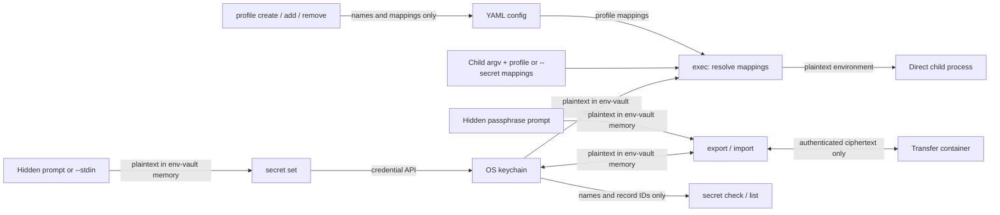

# env-vault

Run a command with secrets from the operating system keychain injected into its
environment. Profiles store only secret names and environment mappings in YAML.
Secret values stay out of shell history and plaintext config.

env-vault is an independent Go CLI at
`github.com/ildarbinanas-design/env-vault`, unaffiliated with any employer,
vendor, or similarly named vault product.

## Install

### Homebrew — macOS and Linux

```sh
brew install ildarbinanas-design/tap/env-vault
brew upgrade env-vault
```

Supported targets: macOS 15+ arm64/amd64, Linux arm64/amd64, and Windows amd64.
Homebrew serves the macOS and Linux targets through
[homebrew-tap](https://github.com/ildarbinanas-design/homebrew-tap).

**Use Homebrew on macOS.** Release binaries are not Developer ID signed or
notarized, so manual downloads carrying Gatekeeper quarantine cannot launch.
Homebrew does not attach that attribute. See
[macOS installation and Keychain access](docs/security.md#macos-installation-and-keychain-access).

When replacing a manual or `go install` installation, inspect `type -a env-vault`
and `brew link --overwrite env-vault --dry-run` first. Back up the exact
unmanaged file reported by the dry run to a new, unused path, then run
`brew link env-vault` and `hash -r`. Check `type -a env-vault` and
`env-vault --version` again; an earlier entry on `PATH` can still select the
old binary. The formula does not automatically overwrite unmanaged files.

### Manual download — Linux and Windows

Current version: `v0.4.7`. <!-- x-release-please-version -->

Use the [latest published release](https://github.com/ildarbinanas-design/env-vault/releases/latest).
For Linux, substitute the release version and architecture:

```sh
VERSION=vX.Y.Z TARGET=linux-amd64
curl -fsSLO "https://github.com/ildarbinanas-design/env-vault/releases/download/${VERSION}/env-vault-${TARGET}.tar.gz"
curl -fsSLO "https://github.com/ildarbinanas-design/env-vault/releases/download/${VERSION}/env-vault-${TARGET}.tar.gz.sha256"
sha256sum -c "env-vault-${TARGET}.tar.gz.sha256"
gh attestation verify "env-vault-${TARGET}.tar.gz" \
  --repo ildarbinanas-design/env-vault \
  --signer-workflow ildarbinanas-design/env-vault/.github/workflows/release.yml \
  --source-ref refs/heads/main \
  --deny-self-hosted-runners
tar xzf "env-vault-${TARGET}.tar.gz"
./env-vault-${TARGET}/env-vault --version
```

Windows uses the `windows-amd64` ZIP archive and its matching SHA-256 file.
A checksum detects a damaged download; the attestation verifies that the file
came from this repository's release workflow on `main`. For an installed
binary, use its path as the first argument to the same verification command,
keeping all verification flags. Releases through v0.3.4 used the previous
pipeline and do not verify with these flags. See
[ADR 0012](docs/adr/0012-attestation-verification-pins-release-workflow.md).

### From source

Source builds require Go 1.26.8 or newer. CI and release builds use the exact
patch in `go.mod`.

```sh
GOTOOLCHAIN=go1.26.8 go build -o env-vault ./cmd/env-vault
./env-vault version
```

## Quickstart

```sh
env-vault secret set nexus-token
env-vault profile create dev
env-vault profile add dev nexus-token:NPM_TOKEN
env-vault exec dev -- make test
```

`secret set` reads a hidden prompt. For a pipe or file, use `--stdin`; it refuses
a terminal and trims exactly one trailing `\n` or `\r\n`. There is no
`secret get` command or secret-value flag.

On macOS and Linux, the hidden prompt accepts long pasted lines without
truncation. Enter finishes the line; Backspace removes one UTF-8 character,
Ctrl+U clears the line, and Ctrl+W removes trailing whitespace and the previous
word. Ctrl+D ends an empty prompt and is ignored after input. If a secret
exceeds 64 KiB, press Enter to finish discarding the line: the command returns
`SECRET_TOO_LARGE` without opening the backend. Ctrl+C restores the terminal
and discards partial input. Windows and BSD keep their native prompt editing.

New values written by `secret set` or `import` are limited to 64 KiB (65536
bytes), or a smaller backend limit: Windows Credential Manager allows 2560
bytes. Oversized input returns `SECRET_TOO_LARGE` with the applicable byte
limit. Existing larger values remain usable by `secret check`, `exec` and
`export`; these commands do not apply the new write limit.

You can also supply a mapping directly:

```sh
env-vault exec --secret nexus-token:NPM_TOKEN -- make test
```

`exec` launches the supplied argv directly and returns the child's exit status.
Use an explicit shell only when needed, for example
`env-vault exec dev -- bash -lc 'make test'`. See
[process and signal behavior](openspec/specs/exec/spec.md) for Unix signal handling.

The 64 KiB write limit leaves room below common per-string environment limits,
but the OS also limits the combined environment and command arguments. Long
names, many secrets or large arguments can still prevent a launch. When the
OS reports this size failure, `exec` returns `RUNTIME_ERROR` (exit `1`) and
asks you to reduce the size or number of secrets.

### How values move



Secret values are plaintext in env-vault's memory while handled, and in the
launched child's environment. YAML and CLI metadata contain no values; transfer
files hold values as authenticated ciphertext, with a public format header.
The child controls what it does with the values it receives.

## Commands

Use `env-vault <command> --help` for arguments and flags.

| Command | Purpose |
|---|---|
| `version` / `--version` | Show build version, commit and date. |
| `secret set <name> [--stdin] [--verify] [--service <name>]` | Create or overwrite a secret; optionally read it back and compare. |
| `secret check <name> [--service <name>]` | Check existence using metadata. |
| `secret list` | List names in the default service. |
| `secret delete <name> --confirm <name> [--service <name>]` | Delete a stored secret. |
| `profile create <profile> [--local\|--global]` | Create a profile; local is the default. |
| `profile add <profile> <secret-name:ENV_NAME> [--check-secret]` | Add a mapping, optionally checking existence first. |
| `profile remove <profile> <ENV_NAME\|secret-name:ENV_NAME>` | Remove by environment name or exact pair. |
| `profile show <profile>` | Show mappings without values. |
| `exec [profile] [--secret <name:ENV_NAME> …] -- <cmd> [args…]` | Resolve secrets and run a child process. |
| `doctor` | Report config/backend status without reading values. |
| `export --out <path>` / `import <path>` | Move values through an encrypted container. |

`exec` refuses existing environment targets unless `--override-env` is set.
`--clean-env` starts with a minimal environment that retains essentials such as
`PATH` and `HOME`. Target names are compared without regard to case on every
platform. See [resolution rules](openspec/specs/exec/spec.md).

Overwriting a secret reports `overwritten`. Its `record_id` identifies the
service/name pair and stays unchanged when the value changes; `fingerprint` is
a deprecated alias. `--verify` compares the value read back in constant time.
A failure reports `SECRET_UNVERIFIED` or a backend error after the write;
it does not roll the write back. See [record identity](openspec/specs/secret-storage/spec.md).

## Profiles and config

The local `.env-vault.yaml` takes priority over the user config. Fallback occurs
only when the local file is absent. Unreadable files, symlinks, non-regular
paths, or trailing YAML documents return `CONFIG_INVALID`.

| Platform | User config |
|---|---|
| Linux | `$XDG_CONFIG_HOME/env-vault/config.yaml`, otherwise `~/.config/env-vault/config.yaml` |
| macOS | `~/Library/Application Support/env-vault/config.yaml` |
| Windows | `%APPDATA%\env-vault\config.yaml`, otherwise `~/AppData/Roaming/env-vault/config.yaml` |

Use `--config <path>` to select a file explicitly. A profile contains mappings,
not secret values:

```yaml
version: 1
profiles:
  dev:
    secrets:
      - name: nexus-token
        env: NPM_TOKEN
        required: true
```

Mappings are portable and may be versioned with the project that uses them.
This repository ignores its own local `.env-vault.yaml` and persistent
`.env-vault.yaml.lock`; decide explicitly which mapping file to track in a
consumer project. Profile mutations are serialized through that adjacent lock;
a timeout returns `CONFIG_LOCKED`. See [config storage](openspec/specs/profile-config/spec.md).

## Output and dry run

Global flags: `--json`, `--jsonl`, `--quiet`, `--verbose`, `--output <path>`,
`--config <path>` and `--dry-run`. JSON and JSONL are mutually exclusive.

```sh
env-vault --json secret check nexus-token
env-vault --dry-run exec dev -- make test
env-vault --quiet --output env-vault-meta.json exec dev -- make test
```

Dry runs validate without storing secrets, modifying profiles, or launching a
child. An explicitly requested `--output` file can still receive metadata.

Errors contain `code`, `message` and `remediation`. For `exec`, child stdout and
stderr pass through and can break machine-readable stdout. A failed child keeps
its exit status; env-vault records `COMMAND_FAILED` only in `--output`, with
`data.exit_code` and, when applicable, `data.signal`.

After a child completes successfully, a failure to write `--output` keeps exit
code `0` and the usual success output, including JSON/JSONL with `--quiet`.
For both successful and failed children, only `--verbose` adds
`OUTPUT_WRITE_FAILED` on stderr; `--quiet` does not suppress that diagnostic.
An older metadata record may remain, so check it before relying on it. env-vault
does not rerun the child because writing metadata failed.

Output-path conflicts detected before execution still prevent the child from
starting. Errors starting or waiting for the child, copying its streams, or
writing env-vault's own stdout retain their existing failure behavior. Metadata
write failures also remain errors for other commands and `exec --dry-run`.

Use a separate regular file for `--output`, never a config, config lock or
transfer container. See the [output, dry-run and version contract](openspec/specs/cli-output/spec.md)
and the [exec result rules](openspec/specs/exec/spec.md).

## Move secrets to another machine

```sh
env-vault export --out vault.evb
env-vault import vault.evb
```

Both commands use a hidden passphrase prompt; export asks twice. The container
carries values only. Transfer your mapping file separately.
On macOS and Linux, these prompts support the same long input and editing as
`secret set`; the passphrase and confirmation can be pasted as two lines at
once. The secret-value size limit does not cap passphrase length.

- Export includes the default service. Add custom services with
  `--with-services team/ci,team/ops` or repeat the flag; they cannot be discovered
  automatically.
- Export refuses an existing destination unless `--force` is set.
- Import defaults to `--on-conflict fail`: any existing secret prevents all
  writes. Use `skip` or `overwrite` deliberately. Later backend failures can
  leave a partial import.
- Import checks the size of every selected write before writing anything,
  including with `--dry-run`. Existing entries left alone by `skip` are exempt.
  Older containers, including v0.4.2 containers, can still be opened, but an
  oversized value selected for writing now rejects the import. This changes
  which old containers can be imported, without changing the container format.
- Containers are AES-256-GCM encrypted under an Argon2id-derived key. Their
  strength depends on the passphrase; copies cannot be revoked. Keep `*.evb`
  out of git and synced folders.

Read [container limits and security](docs/security.md#transfer-containers) before
exporting. Neither command reads or writes a profile config.

## Security and platform notes

env-vault reduces accidental exposure in config and shell history. A trusted
child receives the values and can print or forward them; on Linux, the same
user may also be able to inspect process environments through `/proc`.

- Production storage uses macOS Keychain, Linux Secret Service/KWallet/`pass`,
  or Windows Credential Manager. There is no plaintext production fallback.
- Windows secrets are limited to 2560 bytes and secret names are
  case-insensitive. See [backend details](docs/security.md#backend-assumptions).
- After a Homebrew upgrade on macOS, run each profile interactively once and
  approve its Keychain access. An unanswered or denied prompt causes
  `BACKEND_UNAVAILABLE`; calls wait at most two minutes.
- Rotate/revoke credentials externally, then run `secret set` again. Remove
  stale mappings with `profile remove`; destroy old containers after rotation.
- Never put values in shell initialization, reports, screenshots or logs. Use
  [private vulnerability reporting](SECURITY.md#reporting-a-vulnerability).

The [security model](docs/security.md) covers prompt signals, backend selection,
the explicit test-only gate, and filesystem/threat-model limits.

## Development and releases

- [CONTRIBUTING.md](CONTRIBUTING.md): pull requests and local checks.
- [Specifications](openspec/specs/): the normative behavior of every command
  and of the release pipeline.
- [Design](docs/design.md): architecture and the reasons behind it.
- [E2E verification](docs/e2e.md): scenarios, native platform matrix and reports.
- [RELEASING.md](RELEASING.md): Release Please, release authorization, delivery
  checks and recovery. Only merging the generated release pull request
  authorizes a release; no workflow runs on a tag.
- [ADRs](docs/adr/README.md): recorded design decisions and historical contracts.
