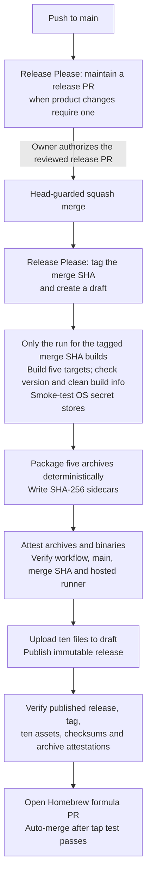

# Releasing env-vault

[ADR 0011](docs/adr/0011-minimal-release-pipeline.md) and
[ADR 0012](docs/adr/0012-attestation-verification-pins-release-workflow.md)
define the release contract. [`.github/workflows/release.yml`](.github/workflows/release.yml)
runs on pushes to `main`; no workflow runs on a tag.

## Authorize a release

Release Please maintains the generated release pull request when product
changes require a release. `feat`, `fix`, `perf`, and `revert` create releases;
`docs`, `ci`, `build`, `test`, `refactor`, and `chore` do not. Dependabot uses
`fix(deps)` for Go modules and `ci(deps)` for Actions updates. See
[CONTRIBUTING.md](CONTRIBUTING.md) for title and version rules.

**Merging the generated release pull request authorizes its exact version.**
Review the version, changelog, manifest and marked README line, confirm the
required checks are green, then merge the reviewed head:

```sh
gh pr merge <number> --repo ildarbinanas-design/env-vault \
  --squash --match-head-commit <full-head-sha>
```

Either maintainer may authorize a release. An agent needs the owner's explicit
instruction ([AGENTS.md](AGENTS.md)). A changed head requires a new review.

## From merge to Homebrew

An ordinary push maintains release planning. Publication follows the merge of
the generated release pull request; only the run for its tagged commit builds.



The five targets are Linux amd64/arm64, macOS amd64/arm64, and Windows amd64.
The `build` job checks the tag, the unmodified Go build information, and
`--version` before uploading each binary and running the backend smoke test.
Full E2E runs in CI on its own builds; release binaries get the release job's
build checks and backend smoke tests.

`publish` attests all five archives and all five binaries before publishing
five archives and their five checksum files. `verify` downloads the published
files, requires an immutable release and the expected tag commit, and checks
the assets and archive attestations. `tap` then generates the formula from
those archives. The tap's required `test` checks the complete formula against
its reviewed template and published checksums before auto-merge.

**Never publish the draft by hand.** If it becomes immutable before the run
uploads its files, that version cannot be completed. See recovery below.

## Verify a release

```sh
TARGET=darwin-arm64
gh release download vX.Y.Z --repo ildarbinanas-design/env-vault \
  --pattern "env-vault-$TARGET.tar.gz*"
shasum -a 256 -c "env-vault-$TARGET.tar.gz.sha256"
gh attestation verify "env-vault-$TARGET.tar.gz" \
  --repo ildarbinanas-design/env-vault \
  --signer-workflow ildarbinanas-design/env-vault/.github/workflows/release.yml \
  --source-ref refs/heads/main \
  --deny-self-hosted-runners
```

For an installed binary, pass `"$(command -v env-vault)"` instead of the
archive. `-R` alone accepts attestations from any branch or workflow in the
repository. The release workflow also pins `--source-digest` to the release
commit (ADR 0012).

Rebuilding from the tag with the Go version in `go.mod` reproduces the Linux
and Windows binaries. Repackaging the published binaries with
`scripts/release/package-archives.sh` and `SOURCE_DATE_EPOCH` set to the commit
time reproduces all five archives. Darwin binaries use cgo and require macOS
to rebuild.

## When a release fails

Inspect the current run, release and tap PR before retrying an ambiguous
mutation. Use **Re-run failed jobs** on the same run. A re-run keeps the
original workflow and commit, so it cannot fix a defect in either. **Re-run all
jobs** after publication skips `verify` and `tap` and can end green without
finishing them.

| Failure | Recovery |
| --- | --- |
| Release commit has no tag | Re-run the failed job so Release Please can create it. |
| Release commit's tag points to another commit | Abandon that version; tags cannot be moved or deleted. |
| A draft asset differs from the build | `publish` stops without replacing it. The owner deletes the broken draft asset, then re-runs the failed job. Matching uploaded bytes are reused. |
| `publish` is retried after publication | It succeeds only if the release already has exactly the built files. |
| Tap PR or branch already exists | The job reuses it only if the branch changes just the formula and its content matches the expected state. It never downgrades the tap. |
| Tap `test` fails | Fix the cause in the open PR and let auto-merge finish. |
| Draft was published before files were uploaded | Abandon the version; an immutable release cannot receive the missing files. |

To abandon a version that cannot be completed, label its release pull request
`autorelease: abandoned`, fix the cause, and release a higher version.

## Configuration and external settings

- `release-please-config.json` enables draft releases and tag creation
  (`force-tag-creation`) and hides non-product changelog sections.
  `.release-please-manifest.json` holds the version.
- `release-planning` holds `RELEASE_PLANNING_TOKEN`; `release` holds
  `HOMEBREW_TAP_TOKEN`. Both environments admit only `main`. Planning uses a PAT
  because a PR created with `GITHUB_TOKEN` would not run the required checks.
- Immutable releases and the `main`/`v*` rulesets protect publication. Required
  `main` checks are `quality-gate`, `pr-title`, `Dependency review`,
  `Analyze (go)`, and `Analyze (actions)`.

[External settings](docs/release-external-settings.md) lists permissions,
rulesets, token expiry and rotation. Check it at each audit and after settings
changes; the release workflow does not verify those settings itself.

## Versions that must stay unpublished

- `v0.0.8` through `v0.0.11` are failed immutable tags. They stay without a
  GitHub Release.
- `v0.0.12` (PR #31) and `v0.3.3` (PR #102) are abandoned. Neither may get a tag
  or release.
- Published releases are immutable; corrections ship in a higher version.

## Historical releases

The generated v0.3.4 changelog links to abandoned v0.3.3. Use the
[v0.3.2 to v0.3.4 comparison](https://github.com/ildarbinanas-design/env-vault/compare/v0.3.2...v0.3.4)
for the changes between published releases. The runtime fix first shipped in
v0.3.4 preserves ignored SIGHUP and SIGINT under `nohup`
([#101](https://github.com/ildarbinanas-design/env-vault/pull/101));
[#103](https://github.com/ildarbinanas-design/env-vault/pull/103) repaired the
previous pipeline's handling of a deleted GitHub App author. Repeated older
entries, including encrypted transfer (#78), artifact lifecycle tooling (#60)
and the initial MVP, do not date those features to v0.3.4.

Releases through v0.3.4 used the previous pipeline. Its procedures remain in
[`RELEASING.md` at v0.3.4](https://github.com/ildarbinanas-design/env-vault/blob/1fd6638295fb616189e66da7cc110cf4831a3d94/RELEASING.md).
Migration [#107](https://github.com/ildarbinanas-design/env-vault/issues/107)
removed that code; git history, generated changelog and immutable releases
retain the record.
