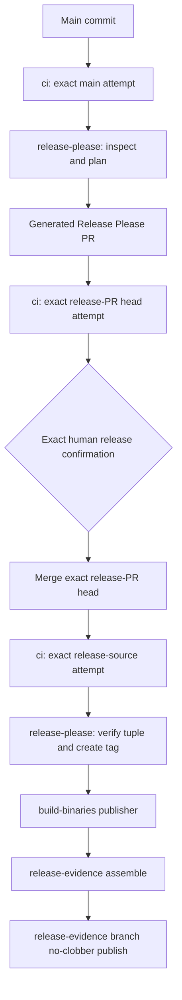
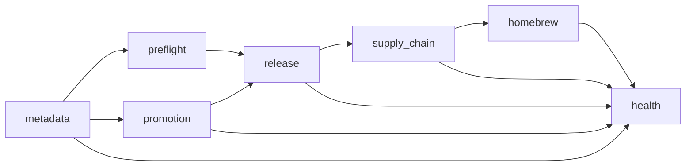

# Release architecture and refactor baseline

Status: immutable pre-refactor baseline plus dated stage deltas, 2026-07-19.
The machine-readable baseline companion is
[`release/refactor-baseline.v1.json`](../release/refactor-baseline.v1.json). It
pins `env-vault` to
`c7dd1fd6176ac2abbea22f226795a0787e774c1b` and `homebrew-tap` to
`71217af8d0c692e27d8c268c9cce5a2a533f4ea9`.

This document describes the release system that published `v0.0.15`; it is not
a new release contract and does not change product behavior. `v0.0.12` is the
permanently abandoned no-tag/no-Release incident, while published `v0.0.13`
through `v0.0.15` are immutable. None of their historical state, tags, assets,
or evidence may be rewritten. Historical incident pins in
`release/contract.v1.json` and the independent Go validator remain security
evidence, not operational defaults to copy into new code.

## Measurement rules

The JSON baseline defines every counter. Source lines are physical
newline-delimited records, with nonblank lines reported separately. Static job
definitions count top-level YAML `jobs` entries before matrix and reusable
workflow expansion. Actions job counts and timing are from exact run attempts;
wall time is run `updatedAt - startedAt`, and aggregate runner time is the sum of
job `completedAt - startedAt` spans.

Git evidence sizes have deliberately narrow meanings. `logical_path_bytes`
counts every Git tree path, including two paths that point at the same blob.
`unique_git_blob_uncompressed_bytes` counts each distinct blob object once.
Neither number claims network transfer, compressed artifact size, GitHub hosted
storage, or billing usage.

## Measured `v0.0.15` release graph



The only intended manual release transition is the exact tuple confirmation
immediately before the generated release PR merge:

```text
ПОДТВЕРЖДАЮ RELEASE <version> PR #<number> SHA <exact-head-sha>
```

Implementation PRs remain ordinary reviewed PRs and do not consume that
release authorization. After the exact release PR is merged, planning must
re-observe the green repository-owned main attempt, the PR authorization, all
five promotion proofs, and all ten packaged assets before creating the tag.
The publisher promotes those CI-built artifacts; it does not rebuild the
product.

The publisher's seven-job dependency shape is shown below with transitively
redundant direct `needs` edges suppressed for readability; the YAML retains
those explicit defensive dependencies.



`supply_chain` creates or verifies provenance and SPDX attestations. `homebrew`
derives the URL and SHA from the published release, creates or reuses a
deterministic tap PR, requires exact PR-head CI, merges that head, and requires
exact post-merge CI. `health` independently re-observes the release, ten assets,
attestations, Homebrew tuple, repository-settings proof, blocked tags, and the
abandoned-release policy. Only a successful publisher run is eligible for the
normal evidence listener.

### Workflow and authority map

| Repository/workflow | Static jobs | Trigger and role | Mutation authority |
| --- | ---: | --- | --- |
| `env-vault/ci.yml` | 2 (12 expanded in the measured run) | PR, main push, dispatch; calls reusable quality and seals its gate | none |
| `env-vault/reusable-quality.yml` | 5 (11 expanded) | reusable source, license, five-target native/E2E quality | none |
| `env-vault/release-please.yml` | 3 | completed main CI; inspect, bounded whole-attempt rerun, planning/tag transition | isolated Actions write for rerun; scoped App writes for planning/tag |
| `env-vault/build-binaries.yml` | 7 | exact tag or explicit repair; promotion and publication | Contents write only in release; attestation writes only in supply chain; scoped tap App in Homebrew |
| `env-vault/release-evidence.yml` | 2 | successful publisher completion | read-only assembly; Contents write only in replaying publisher job |
| `env-vault/legacy-rebuild.yml` | 2 | manual diagnostics for `v0.0.1`-`v0.0.7` | none; publication is contract-forbidden |
| two App audit workflows | 2 total | manual least-privilege audit | metadata/settings observations only |
| dependency review and PR-title workflows | 2 total | PR policy | no release mutation |
| `homebrew-tap/test-formula.yml` | 2 (3 expanded) | PR and main push; two macOS formula tests plus required gate | none |

Planning, publisher, and evidence use the shared `env-vault-release`
concurrency group with `cancel-in-progress: false` and `queue: max`. The queue
capacity is 100; GitHub's documented behavior does not guarantee FIFO dispatch
ordering, so correctness must come from exact identity revalidation rather than
arrival order. CI uses separate identities for dispatches, reruns, PRs, and
refs and cancels superseded runs without cancelling the shared release path.

## Measured source surface

| Scope | Files | Static jobs | Physical lines | Nonblank lines |
| --- | ---: | ---: | ---: | ---: |
| `env-vault` workflows | 10 | 25 | 3,646 | 3,395 |
| `homebrew-tap` workflows | 1 | 2 | 57 | 47 |
| Both workflow sets | 11 | 27 | 3,703 | 3,442 |
| `scripts/release` (`26` shell + `2` jq) | 28 | — | 4,450 | 4,008 |
| Release Go core, including package tests | 44 | — | 13,433 | 12,539 |

The Go core is exactly `cmd/releasecheck`, `cmd/release-extract`,
`cmd/release-version-probe`, and the `internal/releasearchive`,
`releasecontract`, `releaseevidence`, `releasemetrics`, `releasepromotion`, and
`releasesettings` packages. Its 13,433 lines split into 8,617 non-test and 4,816
unit-test lines. Twelve release-operator integration test files add 6,804
lines; `tests/process_config_test.go` is excluded as product behavior. The
durable E2E-baseline tool is adjacent but deliberately separate: nine files,
2,090 physical lines, and 1,963 nonblank lines.

## Exact successful-run metrics

The old numbers are the checked-in comparator, not a claim about the current
graph. The current numbers are the exact successful `v0.0.15` attempts stored
in durable evidence.

| Scenario | Historical run: jobs / wall / runner-s | `v0.0.15` run: jobs / wall / runner-s | Current minus historical |
| --- | --- | --- | --- |
| Main CI | `29475607744`: 25 / 387 / 1,253 | `29576181486`: 12 / 240 / 910 | -13 / -147 / -343 |
| Release-PR CI | `29479484474`: 25 / 359 / 1,205 | `29572388235`: 12 / 270 / 893 | -13 / -89 / -312 |
| Publisher | `29475939348`: 30 / 417 / 1,280 | `29576465336`: 7 / 546 / 527 | -23 / **+129** / -753 |
| Total | 80 / 1,163 / 3,738 | 31 / 1,056 / 2,330 | -49 / -107 / -1,408 |

There is no blanket speedup claim: the publisher wall time regressed by 129
seconds even though its job and aggregate runner counts fell. The evidence run
`29576963736` had two jobs, a 60-second workflow-start-to-update span, and 56
summed job-active seconds; these two timing values are derived from Actions
timestamps and are not `env-vault.release-metrics.v1` output.

The tap's `v0.0.15` PR-head run `29576677229` and post-merge run `29576768487`
were both attempt 1 and successful. Each expanded to two platform tests and one
required gate.

## Evidence footprint before refactoring

At immutable evidence commit
`af521d52b898088cb49f6256964e377e33e95a5d` (parent
`68547bd880a4d49f44389476b77046aac2ab1675`):

| Projection | Paths | Logical path bytes | Unique blobs | Unique blob uncompressed bytes |
| --- | ---: | ---: | ---: | ---: |
| `v0.0.15` root plus publisher-attempt mirror | 8 | 2,964,270 | 4 | 1,482,135 |
| Entire `evidence/` namespace | 27 | 5,964,242 | 19 | 2,999,380 |

The root `release-evidence.json` is 1,475,191 bytes. Its ten attestation
verification entries embed only two unique documents: 1,343,205 bytes when
each entry is counted, 268,641 bytes after content deduplication, and 1,074,564
duplicate bytes (80%). The exact evidence run's GitHub Actions artifacts API
reports 178,515 archive bytes for artifact `8405407104` (candidate) and 175,700
archive bytes for artifact `8405417386` (published evidence). Those are the
API's `size_in_bytes` values, not inferred transfer, hosted-storage, or billing
usage. The current monolithic evidence nevertheless passes complete offline
replay. Stage 3 must preserve that semantic coverage while migrating through
dual-write and parity checks.

## Duplication and hard-coded boundaries

Counts in this section cover operational source only: env-vault workflows and
`scripts/release` shell/jq files. The canonical contract and its independent Go
validator are excluded from literal counts.

- There are 44 direct `gh api` call sites in 17 files: 36 reads and 8
  mutations. Thirty-five of the 36 read sites bypass `gh-api-read.sh`. The
  bounded helper itself has 37 call sites in six callers. Retries, response
  shapes, pagination, and workflow/run/job/attempt identity are therefore still
  fragmented.
- Repository literals occur 10 times across five files for env-vault and twice
  in one file for the tap. `Formula/env-vault.rb` occurs 18 times across three
  files. The Release Please branch literal occurs seven times across six files.
- Workflow filenames occur repeatedly: `ci.yml` 16 times across seven files,
  `release-please.yml` five across two, `build-binaries.yml` eight across four,
  and `release-evidence.yml` once.
- Every platform ID occurs seven times outside the contract; four files carry
  each Unix ID, and three carry `windows-amd64`. The exact shared concurrency
  literal occurs in three workflows.
- `release/contract.v1.json` and `internal/releasecontract/contract.go` form a
  paired policy boundary rather than a literal single source. The validator
  independently pins canonical targets and immutable incidents. Stage 4 may
  centralize operational parameters, but must not remove independent historical
  anchors that prevent contract downgrade.
- The same reviewed `actions/setup-go` SHA has 17 `v6.5.0` comments and one
  stale `v6.3.0` comment. The tap uses floating `actions/checkout@v7`, unlike
  env-vault's full-SHA action pins.
- Evidence genesis was manual at this baseline: publication failed when
  `release-evidence` did not exist, and bootstrapping the branch required
  separate operator work. Stage 3 replaced that fresh-repository path without
  changing the existing production history.

### Stage 2 measured transport delta

The bullets above and `release/refactor-baseline.v1.json` remain the immutable
pre-change baseline. After Stage 2, the same operational-source measurement is:

| Measure | Before | After Stage 2 | Delta |
| --- | ---: | ---: | ---: |
| Direct `gh api` sites | 44 | 9 | -35 |
| Direct API read sites | 36 | 1 | -35 |
| Direct REST read sites | 35 | 0 | -35 |
| Direct REST mutations | 8 | 8 | 0 |
| Direct GraphQL observation sites | 1 | 1 | 0 |
| `gh-api-read.sh` call sites | 37 | 62 | +25 |
| Helper caller files | 6 | 19 | +13 |
| Typed Actions identity call sites | 0 | 17 | +17 |

The nine remaining direct API sites are exactly the eight historical mutation
boundaries plus the ruleset GraphQL observation. Their path, operation,
category, inherited owner `release-engineering`, count, and rationale are
machine-checked from `release/github-transport-boundary.v1.json`. Dedicated
high-level `gh` observations/mutations are registered there as well. This is a
source-boundary measurement; it does not imply an Actions runtime reduction.

The physical/nonblank definitions are unchanged from the baseline. The final
Stage 2 source-surface delta is:

| Scope | Before | After Stage 2 | Delta |
| --- | --- | --- | --- |
| env-vault workflows | 10 files / 25 jobs / 3,646 physical / 3,395 nonblank | 10 / 25 / 3,847 / 3,581 | 0 files / 0 jobs / +201 / +186 |
| `scripts/release` shell and jq | 28 files / 4,450 physical / 4,008 nonblank | 29 / 4,521 / 4,083 | +1 file / +71 / +75 |
| new `cmd/releasetransport` + `internal/githubtransport` Go | 0 | 9 files / 2,833 physical / 2,669 nonblank | +9 / +2,833 / +2,669 |
| changed `internal/strictjson/strictjson.go` | 1 file / 250 physical / 230 nonblank | 1 / 265 / 244 | 0 files / +15 / +14 |

The new transport Go surface splits into 1,852 physical non-test lines and 981
physical test lines. It is reported separately rather than folded into the
historical operational shell/workflow baseline. The original Stage 2 target of
removing 200–350 shell lines was not achieved: release shell/jq grew by 71
physical lines while callers migrated behind the typed boundary. Cleanup and
workflow-graph consolidation remain Stage 4 work. The formerly stale
`actions/setup-go` annotation now matches the reviewed `v6.5.0` pin.

Two single observed local runs of
`go test ./tests -run '^TestPublishReleaseEvidenceIsNoClobberAndRaceSafe$' -count=1`
changed from 91.251 seconds to 14.978 seconds (-83.6%) after building the
transport once per integration-test process. Host/tool/cache metadata and
repetitions were not recorded, so this is directional evidence rather than a
benchmark and is not a hosted-runner metric.

### Stage 3 measured evidence delta

Stage 3 added exact capability-based v1/v2 routing, deterministic
content-addressed objects, byte-exact v1 reconstruction and parity, and
automatic evidence-only genesis for a genuinely absent ref. The existing
production ledger remains byte- and history-immutable in `legacy-compatible`
mode; the measurement below is an offline v2 replay of its immutable
`v0.0.15` evidence, not a rewrite or a hosted-storage observation.

| Byte scope | v1 baseline | Stage 3 v2 replay | Change |
| --- | ---: | ---: | ---: |
| Root plus publisher-attempt logical payload | 2,964,270 | 379,550 | -2,584,720 (-87.1%) |
| Deterministic offline export | 1,486,981 | 374,320 | -1,112,661 (-74.8%) |

The six compact metadata files total 10,892 bytes: the 1,887-byte root, 6,944
bytes of other auxiliary metadata, a 593-byte parity record, and a 1,468-byte
self-report. Three objects total 357,677 raw and 357,766 canonical encoded
bytes. Unique Git blob payload is 368,658 bytes; complete offline reconstructed
payload is 368,569 bytes.
These domains deliberately exclude network transfer, artifact billing, and
compression-ratio claims. The bundle format, limits, migration semantics, and
remaining bounded-history work are recorded in
[ADR 0003](adr/0003-compact-release-evidence-ledger.md).

### Stage 4 measured contract and graph delta

Stage 4 moves new operational authority to `release/contract.v2.json` and
closes v1 compatibility through an immutable archived contract plus exact
history registry. The accepted trust-domain decision is recorded in
[ADR 0006](adr/0006-versioned-operational-release-contract.md). Measurements
below compare the Stage 3 base
`ce1ba7186a4d3133fb04075f275f06e6042c0ccb` with the Stage 4 working tree,
using the same physical/nonblank definitions as the baseline.

| Scope | Before Stage 4 | After Stage 4 | Delta |
| --- | --- | --- | --- |
| env-vault workflows | 12 files / 27 static jobs / 5,245 physical / 4,924 nonblank | 12 / 27 / 5,926 / 5,585 | 0 files / 0 jobs / +681 / +661 |
| `scripts/release` shell and jq | 33 files / 6,089 physical / 5,554 nonblank | 35 / 6,457 / 5,905 | +2 files / +368 / +351 |
| `internal/releasecontract` Go | 6 files / 2,521 physical / 2,377 nonblank | 12 / 4,024 / 3,812 | +6 files / +1,503 / +1,435 |
| transport Go (`cmd/releasetransport` + `internal/githubtransport`) | 11 files / 4,060 physical / 3,838 nonblank | 11 / 4,729 / 4,464 | 0 files / +669 / +626 |

This stage preserves all 27 static jobs. The source increase is predominantly
strict decoding/routing, bounded transport, frozen fixtures, and adversarial
tests; it is not presented as a graph-size reduction. Five repeated publisher
activation bodies were consolidated behind one checked helper without
collapsing their cross-job artifact boundaries.

Across workflows and release scripts, raw `release/contract.v1.json` references
fell from 27 to 6 literal occurrences. The six surviving occurrences retrieve
or route immutable source
contracts; none supplies a new operational default. Exact repository literal
matches fell from 12 to 2, and the two survivors are Go module linker paths,
not repository-routing parameters. The digest-bound typed projection is
required at 29 consumer call sites across 18 release workflow/script files (30
occurrences across 19 files when the single helper definition is included).
The contract and static parity tests prove exactly twelve workflow identities
and exactly five shared non-cancelling concurrency participants.

The product implementation diff over `cmd/env-vault`, `internal/config`,
`internal/secretstore`, `internal/runner`, and `internal/output` is empty.
The source measurements above make no hosted Actions timing claim. The first
exact successful hosted comparison is recorded separately below.

### First successful v2-contract hosted metrics

Release `v0.0.17` is the first successful release using the v2 operational
contract. Its comparison is durable at evidence commit
`b0592ee7e9013d750704733d8e030a69056ef319`, path
[`evidence/releases/v0.0.17/metrics-comparison.json`](https://github.com/ildarbinanas-design/env-vault/blob/b0592ee7e9013d750704733d8e030a69056ef319/evidence/releases/v0.0.17/metrics-comparison.json),
Git blob `3994f1934fdcbb05db21e325ff8cff607385867d`. The table compares the
immutable pre-refactor baseline with exact successful attempt 1 of main CI
`29682997343`, release-PR CI `29682351617`, and publisher `29683468172`.
Delta is current minus baseline.

| Scenario | Baseline: jobs / wall / runner-s | `v0.0.17`: jobs / wall / runner-s | Delta |
| --- | --- | --- | --- |
| Main CI | 25 / 387 / 1,253 | 12 / 902 / 1,619 | -13 / +515 / +366 |
| Release-PR CI | 25 / 359 / 1,205 | 12 / 797 / 1,437 | -13 / +438 / +232 |
| Publisher | 30 / 417 / 1,280 | 7 / 537 / 520 | -23 / +120 / -760 |
| Total | 80 / 1,163 / 3,738 | 31 / 2,236 / 3,576 | -49 / +1,073 / -162 |

The job count fell by 61.25% and aggregate runner time by 4.33%, but total wall
time increased by 92.26%. Main and PR aggregate runner time also increased,
and every measured scenario took longer wall-clock time. Baseline queue timing
was not recorded, so this evidence cannot separate queue delay from job-active
or critical-path work and does not establish a cause. No blanket speedup is
claimed. The measurement-first latency investigation in the release backlog
must preserve race detection, all five native targets, product E2E coverage,
named gates, and fail-closed semantics before any later optimization is
considered.

## Preserved invariants and risks

Every stage must retain:

- five independent targets (`darwin` amd64/arm64, `linux` amd64/arm64,
  `windows` amd64), ten exact archive/checksum assets, provenance and SPDX;
- exact repository/workflow/run/job/attempt/source identity with strict
  responses and fail-closed ambiguity handling;
- no product rebuild in the publisher, no-clobber tag/release/assets/evidence,
  and no failed-jobs-only release rerun;
- shared release serialization without cancellation, while preserving safe CI
  cancellation and native-target concurrency;
- the single exact release confirmation and no other manual publication step;
- exact tap PR head, merge/tap ancestry, both tap CI gates, `brew install`, and
  `brew test` before release completion;
- complete offline evidence replay and immutable historical evidence.

Principal risks are identity drift during transport centralization, weakening
least privilege while removing setup duplication, treating queue order as a
correctness property, losing attestation/SBOM material during evidence
compaction, migrating evidence without parity, over-centralizing immutable
history pins, or optimizing job count at the expense of target concurrency and
fail-closed gates. External environments, variables, secrets, rulesets, App
permissions, and required checks remain part of the release contract described
in `docs/release-external-settings.md`; code cleanup cannot silently weaken
them.

## Stage ownership and exit criteria

| Stage | Owns | Required proof before the next stage |
| --- | --- | --- |
| 2: typed GitHub transport | strict workflow/run/job/attempt types, pagination, bounded read retry policy, realistic fixtures | no ad-hoc direct API reads outside the transport; mutation semantics remain explicit and no-clobber |
| 3: durable evidence | versioned automatic evidence-only genesis, dual-write migration, content-addressed compact bundle | implemented with fresh-repository genesis without Workflows write, v1/v2 parity, full offline replay, a 1,887-byte root, and measured 87.1% logical / 74.8% deterministic-export reduction; checkpoint/Merkle and frozen-v1-fixture follow-ups remain tracked |
| 4: release contract and graph | operational repositories, targets, assets, formula and workflow identities; strict historical routing | implemented with canonical v2, immutable v1 archive/registry, typed projections, static parity, twelve exact workflows and five serialized release workflows; source metrics and the first successful v2-contract hosted comparison are recorded above, with the measured latency regression tracked separately |
| 5: Homebrew | release-derived URL/SHA, deterministic formula and tap transition | exact PR and merge tuple, both tap CI gates, formula merged, `brew install` and `brew test` green |
| 6: patch release | Release Please-resolved version, authorization, tag, assets, attestations, SBOM, health, evidence and tap | exact confirmation before merge; published five-target patch; durable offline evidence; green main and tap; no temporary agent context |

Before and after every implementation stage, run the product-diff gate from the
operator runbook against the original implementation base. Stage-level
reductions are targets until exact successful-run and source measurements are
recorded; they must never be reported as observed facts in advance.
