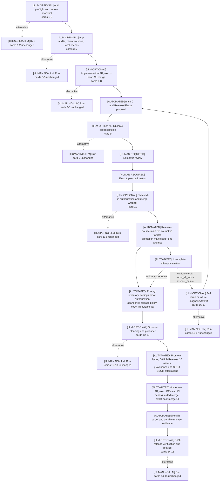

# Release operator runbook

This is the end-to-end operator procedure for an `env-vault` release. It is a
companion to [`RELEASING.md`](../RELEASING.md), which defines the release
contract and repair policy, and
[`release-external-settings.md`](release-external-settings.md), which defines
the GitHub App, environment, and ruleset configuration.

The LLM is never a source of release truth. An LLM may run the same commands as
an operator and summarize machine output, but every gate is based on exact Git
identities, saved GitHub JSON, a checked-in workflow, or the offline
`releasecheck` checker. A human who uses no LLM can complete the same process
with the numbered command cards below.

## Roles and non-negotiable boundaries

- **`[AUTOMATED]`** is a deterministic workflow or offline-checker operation.
  It is not delegated to either a human or an LLM.
- **`[LLM OPTIONAL]`** is operator transport, monitoring, or diagnosis that an
  LLM may perform. Its output is never accepted without the machine check named
  in the corresponding command card.
- **`[HUMAN REQUIRED]`** is semantic review and exact destructive
  confirmation. The release flow has one release-tuple confirmation; a later
  Actions artifact cleanup has its own separate manifest confirmation. These
  decisions cannot be delegated to an LLM.
- **`[HUMAN NO-LLM]`** is the exact manual equivalent of an
  `[LLM OPTIONAL]` operation. It is an alternative execution path, not an
  additional approval.

There is one and only one release stop. Immediately before the generated
Release Please PR is merged, the human reviews and confirms this exact tuple:

```text
ПОДТВЕРЖДАЮ RELEASE <version> PR #<number> SHA <full-sha>
```

The version includes the leading `v`, and the SHA is the full 40-character PR
head. Any change to version, PR number, or head SHA invalidates the
confirmation. There is no other routine confirmation for the implementation
PR, tag planning, publisher, Homebrew, health, or evidence.

The release statement above does not authorize post-release artifact deletion.
That separate, non-routine operation has its own `[HUMAN REQUIRED]` gate and
never substitutes for or reuses a release confirmation:

```text
ПОДТВЕРЖДАЮ DELETE ACTIONS ARTIFACTS COUNT <count> BYTES <bytes> MANIFEST SHA256 <sha256>
```

Never expose a token, private key, OAuth device code, OTP, verification-email
contents, credential-store contents, or secret value in a command line, log,
saved JSON, artifact, evidence file, issue, or PR. Keep shell tracing and GitHub
debug logging disabled around authentication and release operations.

## End-to-end flow



## Operator matrix

| Stage | Responsible role | Machine truth | Effect and permission boundary | No-LLM card |
| --- | --- | --- | --- | ---: |
| `gh` authentication preflight | `[LLM OPTIONAL]` or `[HUMAN NO-LLM]` | non-JSON `gh auth status` exit plus `GET /user` JSON | read-only; local credential store and GitHub metadata read | 1 |
| Remote-state snapshot | `[LLM OPTIONAL]` or `[HUMAN NO-LLM]` | atomic REST JSON files and offline checker JSON | read-only remote; local snapshot files | 2 |
| Planning/tap App audit | `[LLM OPTIONAL]` dispatch; `[AUTOMATED]` audit | exact workflow identity and successful conclusion | dispatch mutation needs Actions write; audit tokens are scoped as documented | 3 |
| Worktree and branch | `[LLM OPTIONAL]` or `[HUMAN NO-LLM]` | exact saved `main` SHA and clean `git status` | local Git/filesystem mutation only | 4 |
| Local tests, vet, race, contract and product-diff gate | `[LLM OPTIONAL]` or `[HUMAN NO-LLM]` | process exits and checker schemas | read-only source evaluation; local build outputs | 5 |
| Implementation PR | `[LLM OPTIONAL]` or `[HUMAN NO-LLM]` | PR REST/`gh --json` object bound to exact head | push and PR mutation; repository Contents and Pull requests write | 6 |
| Exact-head PR CI | `[LLM OPTIONAL]` observation; `[AUTOMATED]` CI | exact run/head/event/workflow and green jobs | read-only; Actions and Checks read | 7 |
| Implementation PR merge | `[LLM OPTIONAL]` or `[HUMAN NO-LLM]` | unchanged head plus required checks; merged PR JSON | squash-merge mutation with `--match-head-commit`; no admin bypass | 8 |
| Main CI and Release Please | `[AUTOMATED]`; observation is `[LLM OPTIONAL]` | exact `main` SHA, workflow run, generated PR identity and files | automation uses release-planning App; operator reads | 9 |
| Semantic release review | `[HUMAN REQUIRED]` | human interpretation of exact generated diff/changelog | no mutation | 10 |
| Exact tuple confirmation | `[HUMAN REQUIRED]` | byte-exact confirmation line for unchanged tuple | authorizes only that tuple; no mutation by itself | 10 |
| Generated release PR authorization and merge | `[LLM OPTIONAL]` or `[HUMAN NO-LLM]` after confirmation | checked-in wrapper, exact PR/base/check/comment tuple | one comment and one head-guarded merge; repository PR/Contents write | 11 |
| Five-target inventory and promotion manifest | `[AUTOMATED]`; observation is `[LLM OPTIONAL]` | `env-vault.attempt-classification.v1` and `env-vault.promotion-verification.v1` | read-only verification of one CI attempt | 12 |
| Tag planning | `[AUTOMATED]`; observation is `[LLM OPTIONAL]` | authorization evidence, settings proof, exact source/tag SHA | only planning App has scoped Contents write; operator does not create a tag | 13 |
| Publisher and no-clobber Release | `[AUTOMATED]`; observation is `[LLM OPTIONAL]` | exact tag trigger, promotion verification, Release with ten assets | publisher-scoped Contents/Attestations writes | 13 |
| Provenance, SBOM and attestations | `[AUTOMATED]`; verification is `[LLM OPTIONAL]` | two verified predicate types for each of five archives | automated OIDC/Attestations write; operator read-only | 14 |
| Homebrew PR-head and post-merge gates | `[AUTOMATED]`; verification is `[LLM OPTIONAL]` | exact formula, PR/head/merge/tap SHAs and two successful run identities | tap App only: Actions read, Contents and Pull requests write | 14 |
| Health and durable evidence | `[AUTOMATED]`; verification is `[LLM OPTIONAL]` | health, observation, and routed evidence v1/v2 schemas | health read-only; append-only evidence Contents write | 15 |
| Incomplete-attempt classification | `[AUTOMATED]`; guarded rerun can be `[LLM OPTIONAL]` | `rerun_all_jobs` / `ATTEMPT_MATRIX_INCOMPLETE`, checker exit `4` | re-snapshot read; isolated Actions write mutation | 16 |
| Failure diagnosis and separate fix PR | `[LLM OPTIONAL]` or `[HUMAN NO-LLM]` | exact failed run/job/step/log/artifact tuple | diagnosis read-only; fix uses normal branch/PR permissions | 17 |
| Post-release verification and metrics | `[LLM OPTIONAL]` or `[HUMAN NO-LLM]` | immutable tag/Release/tap/evidence JSON and metrics schemas | read-only except already-automated evidence publication | 15 |
| Artifact post-merge collection, replay, and compact package | `[LLM OPTIONAL]` or `[HUMAN NO-LLM]` | complete private replay plus content-addressed manifest object/summary | Actions read; local packaging, then a normal small reviewed PR | A1 |
| Artifact manifest authorization | `[HUMAN REQUIRED]` | byte-exact count/bytes/semantic-SHA confirmation | authorizes only the reviewed manifest; no mutation by itself | A2 |
| Bounded artifact deletion | `[LLM OPTIONAL]` or `[HUMAN NO-LLM]` after confirmation | exact-ID batch plus synced canonical result chain | Actions artifact delete only; maximum 500 IDs; no run delete or retry | A2 |
| Artifact post-delete and Billing verification | `[LLM OPTIONAL]` or `[HUMAN NO-LLM]` | complete API inventory, keep/terminal proof, later Billing/Usage observation | read-only | A3 |

## Common inputs, machine schemas, and exits

Run all command cards from the repository root. Use a new private temporary
directory for every observation set; never reuse a partially populated set.
Substitute only values first read from machine JSON:

```sh
REPOSITORY=ildarbinanas-design/env-vault
TAP_REPOSITORY=ildarbinanas-design/homebrew-tap
SNAPSHOT_DIR="$(mktemp -d "${TMPDIR:-/tmp}/env-vault-release.XXXXXX")"
umask 077
mkdir -p "$SNAPSHOT_DIR"
go build -trimpath -o "$SNAPSHOT_DIR/releasecheck" ./cmd/releasecheck
```

Current operational schemas are declared by `release/contract.v2.json`.
Historical v1 routing is authorized only by the exact archive and tuples in
`release/history/contract.v1.json` and `release/contract-history.v2.json`; the
live v1 file is not an operational fallback. The key operator-facing schemas
are:

- `env-vault.releasecheck-version.v1` and
  `env-vault.contract-validation.v1`;
- `env-vault.release-contract-operational.v2` and
  `env-vault.release-contract-source-route.v2`;
- `env-vault.release-please-recovery-check.v1`;
- `env-vault.attempt-classification.v1`;
- `env-vault.promotion-manifest.v1` and
  `env-vault.promotion-verification.v1`;
- `env-vault.repository-release-settings-proof.v1`;
- `env-vault.release-authorization.v1`;
- `env-vault.release-health-proof.v1` and
  `env-vault.release-observation.v1`;
- `env-vault.attestation-verification-bundle.v1`;
- `env-vault.release-evidence.v1`, `env-vault.release-evidence-bundle.v2`, and
  `env-vault.release-metrics.v1`;
- `env-vault.actions-artifact-snapshot.v1`,
  `env-vault.actions-artifact-live-collection.v1`,
  `env-vault.actions-artifact-live-observation.v1`,
  `env-vault.actions-artifact-repair-proof.v1`,
  `env-vault.actions-artifact-decision-scope.v1`, and
  `env-vault.actions-artifact-decision-manifest.v1`;
- `env-vault.actions-artifact-manifest-package-summary.v1`; and
- `env-vault.actions-artifact-deletion-batch.v1` and
  `env-vault.actions-artifact-deletion-result.v1`.

`releasecheck` has stable exits: `0` success; `2` CLI usage; `3` invalid or
unsupported contract; `4` a valid classification that requires waiting,
inspection, or `rerun_all_jobs`; `5` invalid, incomplete, or inconsistent
saved input/evidence; `6` internal or no-clobber output failure. A GitHub or
Git command succeeds only on exit `0`. For checked-in shell helpers, usage is
normally `2`, a deterministic failure is `1`, and a documented absence probe
uses `4`. Any unlisted exit stops the release.

The attempt classifier emits only these steady-state decisions:

| Condition | `ok` | `action_code` | `reason_code` | Exit |
| --- | ---: | --- | --- | ---: |
| complete successful current attempt | `true` | `none` | `ATTEMPT_MATRIX_COMPLETE` | `0` |
| run not completed | `false` | `wait_attempt` | `ATTEMPT_NOT_COMPLETED` | `4` |
| missing, duplicate, expired, or unexpected matrix artifact | `false` | `rerun_all_jobs` | `ATTEMPT_MATRIX_INCOMPLETE` | `4` |
| complete matrix but failed CI | `false` | `inspect_failure` | `CI_ATTEMPT_FAILED` | `4` |

Every classification has `rerun_failed_jobs_allowed=false` and includes
`rerun_failed_jobs` in `prohibited_actions`.

## No-LLM command cards

Each card is both the manual procedure and the required manual equivalent for
the corresponding `[LLM OPTIONAL]` operation. An LLM operator must execute the
same commands, consume the same input files, and respect the same stop
conditions.

### 1. Authentication preflight

**Command.** Remove environment-token and host overrides for the command
process without printing their values. The non-JSON status command is the gate:

```sh
env -u GH_TOKEN -u GITHUB_TOKEN \
  -u GH_ENTERPRISE_TOKEN -u GITHUB_ENTERPRISE_TOKEN \
  -u GH_HOST -u GH_ENTERPRISE_HOST \
  gh auth status --active --hostname github.com

env -u GH_TOKEN -u GITHUB_TOKEN \
  -u GH_ENTERPRISE_TOKEN -u GITHUB_ENTERPRISE_TOKEN \
  -u GH_HOST -u GH_ENTERPRISE_HOST \
  gh api --hostname github.com user > "$SNAPSHOT_DIR/auth-user.json"

jq -e '
  (.id | type == "number" and . > 0) and
  (.login | type == "string" and length > 0) and .type == "User"
' "$SNAPSHOT_DIR/auth-user.json" >/dev/null
```

**Inputs and machine result.** Inputs are only the `github.com` credential-store
entry. `GET /user` produces GitHub REST JSON; the `jq` predicate is the local
shape check. `gh auth status --json` is not a gate because the installed CLI
documents that it can exit `0` even when an account is invalid.

**Exit, effect, and permission.** All three commands must exit `0`. They are
remote read-only; credential-store access is local read-only. Metadata and
repository read are sufficient for this preflight.

**Reverify.** Run both GitHub commands again immediately before the first
remote mutation. If authentication is invalid, a human may run
`gh auth login --hostname github.com --git-protocol https --web`; then repeat
the preflight. This is an incident recovery, not a steady-state release step.

**Forbidden.** Never use `--show-token`, `set -x`, `GH_DEBUG`, Git/curl tracing,
`--insecure-storage`, a token on the command line, or saved auth JSON containing
a token. Never ask an LLM to read a device code, email, OTP, keychain prompt, or
credential value.

### 2. Atomic remote snapshot and offline contract/recovery checks

**Command.** Save complete responses with the checked-in bounded read helper:

```sh
scripts/release/gh-api-read.sh \
  "$SNAPSHOT_DIR/main-ref.json" \
  "repos/$REPOSITORY/git/ref/heads/main"
scripts/release/gh-api-read.sh \
  "$SNAPSHOT_DIR/repository.json" \
  "repos/$REPOSITORY"
scripts/release/gh-api-read.sh \
  "$SNAPSHOT_DIR/v013-release.json" \
  "repos/$REPOSITORY/releases/tags/v0.0.13"
scripts/release/gh-api-read.sh \
  "$SNAPSHOT_DIR/tap-pr-6.json" \
  "repos/$TAP_REPOSITORY/pulls/6"

"$SNAPSHOT_DIR/releasecheck" --version --json \
  > "$SNAPSHOT_DIR/releasecheck-version.json"
"$SNAPSHOT_DIR/releasecheck" validate-contract --json \
  > "$SNAPSHOT_DIR/contract-validation.json"
"$SNAPSHOT_DIR/releasecheck" recovery validate-config \
  --contract release/contract.v2.json \
  --config release-please-config.json \
  --manifest .release-please-manifest.json \
  --json > "$SNAPSHOT_DIR/recovery-check.json"
```

Validate the completed recovery record:

```sh
jq -e '
  .schema_id == "env-vault.release-please-recovery-check.v1" and
  .schema_version == 1 and .ok == true and .state == "complete" and
  .abandoned_version == "v0.0.12" and
  .generated_release_pr_number == 31 and
  .reason_code == "PRETAG_AUTHORIZATION_MISSING" and
  .tag_must_not_exist == true and
  .github_release_must_not_exist == true and
  .completed_release_source_sha ==
    "6206b472cda81f7a87656055d8eb6627c26a0fef"
' "$SNAPSHOT_DIR/recovery-check.json" >/dev/null
```

**Inputs and machine result.** The first four outputs are GitHub REST objects;
the checker outputs the version, contract-validation, and recovery-check v1
schemas. Contract success is `ok=true`, platform count `5`, asset count `10`.
Recovery success is `state=complete`; no recovery mutation is inferred from
remote state.

**Exit, effect, and permission.** Exit `0` is required. GitHub operations are
read-only; the only mutation is creation of private local snapshot files.
Repository Contents, Pull requests, and Releases read are sufficient.

**Reverify.** Re-save the exact fields relevant to a later mutation immediately
before that mutation. Never treat a cached response, partial output,
authentication failure, rate limit, or transport error as absence.

**Forbidden.** `gh-api-read.sh` forbids bodies, mutation methods, GraphQL,
custom hosts, and cached observations. Do not overwrite a prior snapshot or
edit JSON into the expected shape.

### 3. GitHub App identity and installation-scope audits

**Command.** Dispatch the checked-in audits at the exact saved `main`, capture
the run URLs returned by each dispatch, and require those exact runs to
succeed. Do not search for “the latest” run:

```sh
MAIN_SHA="$(jq -er '.object.sha | select(test("^[0-9a-f]{40}$"))' \
  "$SNAPSHOT_DIR/main-ref.json")"
PLANNING_AUDIT_URL="$(gh workflow run audit-release-planning-app.yml \
  --repo "$REPOSITORY" --ref main)"
TAP_AUDIT_URL="$(gh workflow run audit-release-app.yml \
  --repo "$REPOSITORY" --ref main)"

if [[ "$PLANNING_AUDIT_URL" =~ ^https://github.com/ildarbinanas-design/env-vault/actions/runs/([1-9][0-9]*)$ ]]; then
  PLANNING_AUDIT_RUN_ID="${BASH_REMATCH[1]}"
else
  echo "planning audit dispatch did not return an exact run URL" >&2
  exit 1
fi
if [[ "$TAP_AUDIT_URL" =~ ^https://github.com/ildarbinanas-design/env-vault/actions/runs/([1-9][0-9]*)$ ]]; then
  TAP_AUDIT_RUN_ID="${BASH_REMATCH[1]}"
else
  echo "tap audit dispatch did not return an exact run URL" >&2
  exit 1
fi

gh run watch "$PLANNING_AUDIT_RUN_ID" --repo "$REPOSITORY" --exit-status
gh run watch "$TAP_AUDIT_RUN_ID" --repo "$REPOSITORY" --exit-status
gh run view "$PLANNING_AUDIT_RUN_ID" --repo "$REPOSITORY" \
  --json conclusion,databaseId,event,headSha,status,url,workflowName \
  > "$SNAPSHOT_DIR/planning-app-audit-run.json"
gh run view "$TAP_AUDIT_RUN_ID" --repo "$REPOSITORY" \
  --json conclusion,databaseId,event,headSha,status,url,workflowName \
  > "$SNAPSHOT_DIR/tap-app-audit-run.json"

jq -e --arg sha "$MAIN_SHA" '
  .headSha == $sha and .event == "workflow_dispatch" and
  .workflowName == "audit-release-planning-app" and
  .status == "completed" and .conclusion == "success"
' "$SNAPSHOT_DIR/planning-app-audit-run.json" >/dev/null
jq -e --arg sha "$MAIN_SHA" '
  .headSha == $sha and .event == "workflow_dispatch" and
  .workflowName == "audit-release-app" and
  .status == "completed" and .conclusion == "success"
' "$SNAPSHOT_DIR/tap-app-audit-run.json" >/dev/null
```

**Inputs and machine result.** Input is the checked-in workflow at current
`main`. Run JSON must identify that `main` SHA and end `status=completed`,
`conclusion=success`. The planning audit requires App slug
`env-vault-release-planning`, installation scope exactly `env-vault`, and no
ruleset bypass. The tap audit requires installation scope exactly one repo,
`ildarbinanas-design/homebrew-tap`; publication separately requires slug
`env-vault-tap-release`.

**Exit, effect, and permission.** Dispatch is a workflow-run mutation requiring
Actions write. The audit itself is read-only: the planning audit token has
metadata and Administration read; the tap audit token has metadata read. App
tokens are revoked by the action post-step.

**Reverify.** Inspect the exact captured run IDs and their job lists, not merely
the dispatch responses or an unrelated latest run. Re-run after any App
identity, key, installation, environment, or ruleset change.

**Forbidden.** Do not broaden either installation, add a bypass actor, grant
Administration write, log installation tokens, or edit an App merely because a
read-only audit was already green.

### 4. Clean worktree and branch

**Command.** Preserve any existing dirty checkout. Resolve the remote SHA from
the saved snapshot and create a separate worktree:

```sh
MAIN_SHA="$(jq -er '.object.sha | select(test("^[0-9a-f]{40}$"))' \
  "$SNAPSHOT_DIR/main-ref.json")"
BRANCH=docs/release-operator-runbook
WORKTREE=/absolute/path/to/env-vault-documentation-release

git fetch origin main
git worktree add -b "$BRANCH" "$WORKTREE" "$MAIN_SHA"
git -C "$WORKTREE" rev-parse HEAD
git -C "$WORKTREE" status --short
```

**Inputs and machine result.** Input is the exact remote `main` SHA. Git has no
JSON schema; `rev-parse` must equal `MAIN_SHA`, and `status --short` must be
empty before edits.

**Exit, effect, and permission.** Exit `0` is required. Fetch is remote
read-only/local ref mutation; worktree/branch creation is local mutation and
needs filesystem write access only.

**Reverify.** Compare `git rev-parse HEAD` to `MAIN_SHA`; record
`git status --short` before and after edits.

**Forbidden.** Do not clean, reset, restore, overwrite, or reuse an unrelated
dirty worktree. Do not branch from an unverified local tracking ref.

### 5. Local quality, recovery, workflow, and product-diff gates

**Command.** From the clean worktree:

```sh
go build -trimpath -o "$SNAPSHOT_DIR/releasecheck" ./cmd/releasecheck
go test ./...
go vet ./...
go test -race ./...
go test ./internal/releasecontract ./cmd/releasecheck ./tests
git diff --check "$MAIN_SHA"

"$SNAPSHOT_DIR/releasecheck" --version --json
"$SNAPSHOT_DIR/releasecheck" validate-contract --json
"$SNAPSHOT_DIR/releasecheck" recovery validate-config \
  --contract release/contract.v2.json \
  --config release-please-config.json \
  --manifest .release-please-manifest.json --json

git diff --exit-code "$MAIN_SHA" -- \
  cmd/env-vault e2e \
  internal/cli internal/config internal/errors internal/output \
  internal/platform internal/redact internal/runner internal/secretstore
```

**Inputs and machine result.** Inputs are the exact branch working tree and the
canonical release files. The first command rebuilds `releasecheck` from that
edited tree rather than reusing the pre-edit binary from card 2. Expected
checker schemas are the version,
contract-validation, and recovery-check v1 documents with `ok=true`,
`state=complete`, and the exact completed `v0.0.13` source SHA. The final Git
command compares the base directly with the working tree, so staged,
committed, and uncommitted product edits cannot be hidden from the
no-product-change proof.

**Exit, effect, and permission.** Every command must exit `0`. Tests are
read-only with local compiler/cache outputs. No GitHub permission is needed.

**Reverify.** Repeat after the final edit and immediately before push. CI must
repeat tests on the exact pushed head; local success is not a release gate.

**Forbidden.** Do not update snapshots to hide a failure, skip race or
adversarial parser tests, change product/E2E behavior, or use a networked
transition to make the offline recovery checker pass.

### 6. Implementation PR

**Command.** Commit the reviewed scoped diff, push the exact branch, and create
one PR non-interactively:

```sh
HEAD_SHA="$(git rev-parse HEAD)"
git push --set-upstream origin "$BRANCH"
PR_BODY="$SNAPSHOT_DIR/implementation-pr-body.md"
test -f "$PR_BODY" && test ! -L "$PR_BODY"
gh pr create --repo "$REPOSITORY" --base main --head "$BRANCH" \
  --title "docs(release): add operator runbook" \
  --body-file "$PR_BODY"
```

Save and validate the result:

```sh
PR_NUMBER="$(gh pr view "$BRANCH" --repo "$REPOSITORY" --json number --jq .number)"
gh pr view "$PR_NUMBER" --repo "$REPOSITORY" \
  --json number,state,isDraft,baseRefName,headRefName,headRefOid,url \
  > "$SNAPSHOT_DIR/implementation-pr.json"
jq -e --arg branch "$BRANCH" --arg head "$HEAD_SHA" '
  .state == "OPEN" and .isDraft == false and .baseRefName == "main" and
  .headRefName == $branch and .headRefOid == $head
' "$SNAPSHOT_DIR/implementation-pr.json" >/dev/null
```

**Inputs and machine result.** Inputs are reviewed commit(s), a reviewed
regular PR body file in the private snapshot directory, branch, and exact head.
The body file must be prepared before the command and must not become a
repository change. Output is GitHub PR JSON bound to that head. There is no
release action/reason code at this stage.

**Exit, effect, and permission.** Exit `0` is required. Push mutates repository
Contents; PR creation mutates Pull requests. No release, tag, or environment
permission is required.

**Reverify.** Re-read `headRefOid` after every push. The implementation PR may
be merged without the release tuple confirmation, but only after the exact
current head is green.

**Forbidden.** Do not use interactive inferred base/head, force-push after
review, mix unrelated changes, or edit the generated Release Please PR.

### 7. Exact-head CI monitoring

**Command.** Resolve the current PR head, wait for required checks, then fetch
enough `ci` candidates to prove that exactly one pull-request run has the
expected workflow, event, branch, and head. Do not select array element zero:

```sh
HEAD_SHA="$(gh pr view "$PR_NUMBER" --repo "$REPOSITORY" \
  --json headRefOid --jq .headRefOid)"
gh pr checks "$PR_NUMBER" --repo "$REPOSITORY" --required --watch
gh run list --repo "$REPOSITORY" --workflow ci.yml \
  --commit "$HEAD_SHA" --event pull_request --limit 100 \
  --json attempt,databaseId,event,headBranch,headSha,workflowName \
  > "$SNAPSHOT_DIR/implementation-ci-candidates.json"
CI_RUN_TUPLE="$(jq -er --arg head "$HEAD_SHA" --arg branch "$BRANCH" '
  [.[] | select(
    .workflowName == "ci" and .event == "pull_request" and
    .headBranch == $branch and .headSha == $head
  )] |
  if length == 1 then .[0] else error("expected one exact PR CI run") end |
  [.databaseId, .attempt] | @tsv
' "$SNAPSHOT_DIR/implementation-ci-candidates.json")"
IFS=$'\t' read -r CI_RUN_ID CI_RUN_ATTEMPT <<< "$CI_RUN_TUPLE"
gh run view "$CI_RUN_ID" --attempt "$CI_RUN_ATTEMPT" --repo "$REPOSITORY" \
  --json attempt,conclusion,databaseId,event,headSha,jobs,status,url,workflowName \
  > "$SNAPSHOT_DIR/implementation-ci.json"
```

Validate at minimum the exact run identity and the five native jobs plus the
two gates:

```sh
jq -e --arg head "$HEAD_SHA" '
  .headSha == $head and .event == "pull_request" and
  .workflowName == "ci" and .status == "completed" and
  .conclusion == "success" and
  ([.jobs[] | select(.name | test("artifact-quality-(linux-amd64|linux-arm64|darwin-amd64|darwin-arm64|windows-amd64)$"))] | length) == 5 and
  ([.jobs[] | select(.name | endswith("e2e-gate"))] | length) == 1 and
  ([.jobs[] | select(.name == "quality-gate")] | length) == 1 and
  all(.jobs[]; .conclusion == "success" or .conclusion == "skipped")
' "$SNAPSHOT_DIR/implementation-ci.json" >/dev/null
```

**Inputs and machine result.** The input is the exact PR head. The output is a
`gh run view` JSON object and required-check state. Native jobs are
`artifact-quality-linux-amd64`, `linux-arm64`, `darwin-amd64`,
`darwin-arm64`, and `windows-amd64`, possibly prefixed by the reusable workflow
display path.

**Exit, effect, and permission.** All operations are read-only and require
Actions/Checks/Pull requests read. `--watch` and the `jq` gate must exit `0`.

**Reverify.** Read `headRefOid` again after checks finish and compare it to
`HEAD_SHA`. Also require the repository's other required checks from the
contract: `pr-title`, Dependency review, CodeQL Go, and CodeQL Actions.

**Forbidden.** Do not accept checks for an older head, a similarly named
workflow, a synthetic manual run, or a cancelled `quality-gate`.

### 8. Merge the implementation PR

**Command.** Re-read the tuple and merge only the exact green head:

```sh
FINAL_HEAD="$(gh pr view "$PR_NUMBER" --repo "$REPOSITORY" \
  --json headRefOid --jq .headRefOid)"
test "$FINAL_HEAD" = "$HEAD_SHA"
gh pr merge "$PR_NUMBER" --repo "$REPOSITORY" \
  --squash --match-head-commit "$HEAD_SHA"
gh pr view "$PR_NUMBER" --repo "$REPOSITORY" \
  --json number,state,mergedAt,mergeCommit,headRefOid \
  > "$SNAPSHOT_DIR/implementation-pr-merged.json"
```

**Inputs and machine result.** Input is the exact green head. Output PR JSON
must be `state=MERGED`, retain that `headRefOid`, and contain a full merge
commit OID.

**Exit, effect, and permission.** The merge is a Pull requests/Contents
mutation. Exit `0` is required. No release confirmation is required for this
implementation PR.

**Reverify.** Save the merge SHA and confirm it appears on `main`; wait for the
automatic push `ci` on that exact SHA.

**Forbidden.** Never pass `--admin`, omit `--match-head-commit`, merge with
failed/pending checks, or reuse the implementation approval as release
authorization.

### 9. Observe main CI and the generated Release Please proposal

**Command.** Bind the main push run to the implementation merge, then locate
the single generated proposal and run the checked-in verifier:

```sh
MERGE_SHA="$(jq -er '.mergeCommit.oid | select(test("^[0-9a-f]{40}$"))' \
  "$SNAPSHOT_DIR/implementation-pr-merged.json")"
gh run list --repo "$REPOSITORY" --workflow ci.yml \
  --commit "$MERGE_SHA" --event push --limit 100 \
  --json attempt,conclusion,databaseId,event,headBranch,headSha,status,workflowName \
  > "$SNAPSHOT_DIR/implementation-main-ci-candidates.json"
IMPLEMENTATION_MAIN_CI_TUPLE="$(jq -er --arg head "$MERGE_SHA" '
  [.[] | select(
    .workflowName == "ci" and .event == "push" and
    .headBranch == "main" and .headSha == $head
  )] |
  if length == 1 then .[0] else error("expected one exact main CI run") end |
  [.databaseId, .attempt] | @tsv
' "$SNAPSHOT_DIR/implementation-main-ci-candidates.json")"
IFS=$'\t' read -r IMPLEMENTATION_MAIN_CI_RUN_ID IMPLEMENTATION_MAIN_CI_RUN_ATTEMPT \
  <<< "$IMPLEMENTATION_MAIN_CI_TUPLE"
gh run view "$IMPLEMENTATION_MAIN_CI_RUN_ID" \
  --attempt "$IMPLEMENTATION_MAIN_CI_RUN_ATTEMPT" \
  --repo "$REPOSITORY" --exit-status

gh pr list --repo "$REPOSITORY" --state open \
  --head release-please--branches--main--components--env-vault \
  --json number,title,headRefOid,baseRefName,isDraft,url \
  > "$SNAPSHOT_DIR/release-proposals.json"
RELEASE_PR_TUPLE="$(jq -er '
  if length == 1 then .[0] else error("expected one release proposal") end |
  [.number, .headRefOid] | @tsv
' "$SNAPSHOT_DIR/release-proposals.json")"
IFS=$'\t' read -r RELEASE_PR_NUMBER RELEASE_PR_HEAD_SHA <<< "$RELEASE_PR_TUPLE"
GITHUB_REPOSITORY="$REPOSITORY" \
  RELEASE_APP_SLUG=env-vault-release-planning \
  scripts/release/verify-release-proposal.sh \
  "$RELEASE_PR_NUMBER" "$RELEASE_PR_HEAD_SHA" \
  > "$SNAPSHOT_DIR/release-proposal-verification.env"
VERSION="$(sed -n 's/^version=//p' \
  "$SNAPSHOT_DIR/release-proposal-verification.env")"
test "$(sed -n 's/^proposal_sha=//p' \
  "$SNAPSHOT_DIR/release-proposal-verification.env")" = "$RELEASE_PR_HEAD_SHA"
[[ "$VERSION" =~ ^v(0|[1-9][0-9]*)\.(0|[1-9][0-9]*)\.(0|[1-9][0-9]*)$ ]]
```

**Inputs and machine result.** Inputs are the green main SHA, the single open
Release Please branch, the canonical config/manifest, and remote PR JSON. The
proposal verifier requires exact author, branch, base, title, allowed changed
files, lifecycle labels, and successful checks. The expected next patch is
derived by Release Please; it is not supplied by the operator.

**Exit, effect, and permission.** Read-only; Contents, Actions, Issues, and
Pull requests read. All commands must exit `0`.

**Reverify.** Read the version from the generated manifest/diff, the PR number
from JSON, and the full `headRefOid` immediately before human review and again
before authorization.

**Forbidden.** Do not set `release-as`, edit the generated version, guess
`v0.0.14`, or proceed if Release Please proposes an unexpected version before
its cause is understood.

### 10. Human semantic review and exact tuple confirmation

This card is `[HUMAN REQUIRED]`; neither an LLM nor automation has a substitute.

**Procedure.** The human reads the exact generated PR diff, version, changelog,
manifest, marked README version, CI result, and full head SHA. The human then
returns exactly:

```text
ПОДТВЕРЖДАЮ RELEASE <version> PR #<number> SHA <full-sha>
```

**Inputs and machine result.** Inputs are immutable snapshots of the exact open
PR and its checks. There is no checker schema for semantic judgment. The
authorization wrapper later creates `env-vault.release-authorization.v1`
evidence for the exact tuple and trusted comment.

**Exit, effect, and permission.** The review has no process exit and performs no
mutation. The confirmation authorizes only the named unchanged tuple.

**Reverify.** Compare every character to a fresh PR read. If any coordinate has
changed, discard the line and request a new confirmation.

**Forbidden.** An LLM must not invent, paraphrase, normalize, infer, or reuse the
line. A PR approval, merge queue state, old comment, or partial SHA is not a
confirmation.

### 11. Authorize and merge the generated release PR

**Command.** After card 10 only, run the checked-in resumable wrapper:

```sh
GITHUB_REPOSITORY="$REPOSITORY" \
  scripts/release/with-typed-contract.sh \
  scripts/release/authorize-and-merge-release-pr.sh \
  "$VERSION" "$RELEASE_PR_NUMBER" "$RELEASE_PR_HEAD_SHA" \
  > "$SNAPSHOT_DIR/release-merge-sha.txt"
```

**Inputs and machine result.** Inputs are the confirmed version, PR number, and
full head SHA plus a local contract byte-identical to the exact PR base. The
wrapper validates the proposal, base, required workflow/check identities and
trusted owner/member comment timing. Success output is exactly the merge SHA;
downstream planning generates `env-vault.release-authorization.v1`.

**Exit, effect, and permission.** Exit `0` is success, `2` is usage, and `1` is
a fail-closed stop. The wrapper performs at most one canonical PR comment write
and one squash merge guarded by `--match-head-commit`. It requires Issues/Pull
requests/Contents write appropriate to those operations and read access to
checks and the exact base contract.

**Reverify.** The wrapper waits for a later GitHub server second, rechecks the
unchanged tuple/checks/comment, reconciles ambiguous responses by reads, reads
the comment after merge, and verifies the merge on `main`. A resumed invocation
must return the same exact merge without a second mutation.

**Forbidden.** Do not split this into `gh pr comment` and `gh pr merge`, omit
the head guard, post the comment after merge, accept a same-second comment, or
manually create a tag or Release.

### 12. Five-target CI inventory and promotion manifest

**Command.** Resolve the generated release merge as `SOURCE_SHA`, prove that
exactly one `ci` push run matches its workflow/event/branch/head, then save the
run and artifact pages, classify offline, download its one manifest and five
package artifacts, and verify:

```sh
SOURCE_SHA="$(tr -d '\n' < "$SNAPSHOT_DIR/release-merge-sha.txt")"
gh run list --repo "$REPOSITORY" --workflow ci.yml \
  --commit "$SOURCE_SHA" --event push --limit 100 \
  --json attempt,databaseId,event,headBranch,headSha,workflowName \
  > "$SNAPSHOT_DIR/release-source-ci-candidates.json"
CI_RUN_TUPLE="$(jq -er --arg head "$SOURCE_SHA" '
  [.[] | select(
    .workflowName == "ci" and .event == "push" and
    .headBranch == "main" and .headSha == $head
  )] |
  if length == 1 then .[0] else error("expected one release-source CI run") end |
  [.databaseId, .attempt] | @tsv
' "$SNAPSHOT_DIR/release-source-ci-candidates.json")"
IFS=$'\t' read -r CI_RUN_ID CI_RUN_ATTEMPT <<< "$CI_RUN_TUPLE"
scripts/release/gh-api-read.sh "$SNAPSHOT_DIR/ci-run.json" \
  "repos/$REPOSITORY/actions/runs/$CI_RUN_ID"
scripts/release/gh-api-read.sh "$SNAPSHOT_DIR/ci-artifacts.json" \
  --paginate --slurp \
  "repos/$REPOSITORY/actions/runs/$CI_RUN_ID/artifacts?per_page=100"

set +e
"$SNAPSHOT_DIR/releasecheck" classify-attempt \
  --run "$SNAPSHOT_DIR/ci-run.json" \
  --artifacts "$SNAPSHOT_DIR/ci-artifacts.json" --json \
  > "$SNAPSHOT_DIR/attempt-classification.json"
CLASSIFIER_STATUS=$?
set -e
test "$CLASSIFIER_STATUS" -eq 0

PROMOTION_NAME="env-vault-promotion-${SOURCE_SHA}-attempt-${CI_RUN_ATTEMPT}"
gh run download "$CI_RUN_ID" --repo "$REPOSITORY" \
  --name "$PROMOTION_NAME" --dir "$SNAPSHOT_DIR/promotion"
for PLATFORM in linux-amd64 linux-arm64 darwin-amd64 darwin-arm64 windows-amd64; do
  gh run download "$CI_RUN_ID" --repo "$REPOSITORY" \
    --name "env-vault-release-${PLATFORM}-attempt-${CI_RUN_ATTEMPT}" \
    --dir "$SNAPSHOT_DIR/assets"
done

"$SNAPSHOT_DIR/releasecheck" promotion verify \
  --manifest "$SNAPSHOT_DIR/promotion/promotion-manifest.json" \
  --source-sha "$SOURCE_SHA" --release-version "$VERSION" \
  --repository "$REPOSITORY" --run-id "$CI_RUN_ID" \
  --run-attempt "$CI_RUN_ATTEMPT" \
  --artifacts-root "$SNAPSHOT_DIR/assets" --json \
  > "$SNAPSHOT_DIR/promotion-verification.json"
```

**Inputs and machine result.** Inputs are one exact `ci` push run and current
artifact inventory. Classification must be
`env-vault.attempt-classification.v1`, `ok=true`, five expected/observed
targets, ten expected/observed artifact envelopes, `action_code=none`, and
`reason_code=ATTEMPT_MATRIX_COMPLETE`. Promotion verification must be
`env-vault.promotion-verification.v1`, `ok=true`, `result=pass`, and match
repository, version, source, run ID, and attempt. The manifest embeds all five
literal-version proofs, source-quality proof, E2E matrix identity, and ten
archive/checksum digests.

**Exit, effect, and permission.** Read-only GitHub operations and local files;
Actions/Contents read. Both checker commands must exit `0`.

**Reverify.** Re-snapshot run and artifact identities immediately before tag
creation and compare them byte-for-byte with the initial identities. Planning
does this automatically.

**Forbidden.** Do not combine attempts, copy artifacts, edit a manifest,
execute an untrusted downloaded binary, or accept fewer/more than five targets
and ten artifact envelopes.

### 13. Tag planning, publisher observation, and narrow repairs

**Command.** Fetch enough candidates to require exactly one planning run and
one tag-triggered first publisher for the exact source. Bind the publisher's
deterministic run name to the version and `repair=none`:

```sh
gh run list --repo "$REPOSITORY" --workflow release-please.yml \
  --commit "$SOURCE_SHA" --limit 100 \
  --json attempt,databaseId,displayTitle,event,headBranch,headSha,workflowName \
  > "$SNAPSHOT_DIR/planning-candidates.json"
PLANNING_RUN_TUPLE="$(jq -er --arg head "$SOURCE_SHA" '
  [.[] | select(
    .workflowName == "release-please" and .displayTitle == "release-please" and
    .event == "workflow_run" and .headBranch == "main" and .headSha == $head
  )] |
  if length == 1 then .[0] else error("expected one exact planning run") end |
  [.databaseId, .attempt] | @tsv
' "$SNAPSHOT_DIR/planning-candidates.json")"
IFS=$'\t' read -r PLANNING_RUN_ID PLANNING_RUN_ATTEMPT <<< "$PLANNING_RUN_TUPLE"
gh run view "$PLANNING_RUN_ID" --attempt "$PLANNING_RUN_ATTEMPT" \
  --repo "$REPOSITORY" --exit-status

TAG_SOURCE="$(scripts/release/resolve-tag-sha.sh "$VERSION" "$REPOSITORY")"
test "$TAG_SOURCE" = "$SOURCE_SHA"

PUBLISHER_TITLE="env-vault-publication event=push version=${VERSION} repair=none"
gh run list --repo "$REPOSITORY" --workflow build-binaries.yml \
  --commit "$SOURCE_SHA" --event push --limit 100 \
  --json attempt,databaseId,displayTitle,event,headBranch,headSha,workflowName \
  > "$SNAPSHOT_DIR/publisher-candidates.json"
PUBLISHER_RUN_TUPLE="$(jq -er --arg head "$SOURCE_SHA" --arg title "$PUBLISHER_TITLE" --arg version "$VERSION" '
  [.[] | select(
    .workflowName == "build-binaries" and .displayTitle == $title and
    .event == "push" and .headBranch == $version and .headSha == $head
  )] |
  if length == 1 then .[0] else error("expected one exact first publisher") end |
  [.databaseId, .attempt] | @tsv
' "$SNAPSHOT_DIR/publisher-candidates.json")"
IFS=$'\t' read -r PUBLISHER_RUN_ID PUBLISHER_RUN_ATTEMPT <<< "$PUBLISHER_RUN_TUPLE"
gh run view "$PUBLISHER_RUN_ID" --attempt "$PUBLISHER_RUN_ATTEMPT" \
  --repo "$REPOSITORY" \
  --json attempt,conclusion,databaseId,displayTitle,event,headSha,jobs,status,url,workflowName \
  > "$SNAPSHOT_DIR/publisher-run.json"
gh run view "$PUBLISHER_RUN_ID" --attempt "$PUBLISHER_RUN_ATTEMPT" \
  --repo "$REPOSITORY" --exit-status
```

Only for an existing exact immutable tag and a diagnosed incomplete stage, a
documented repair may be dispatched at that tag:

```sh
gh workflow run build-binaries.yml --repo "$REPOSITORY" --ref "$VERSION" \
  -f version="$VERSION" -f repair=release-assets
gh workflow run build-binaries.yml --repo "$REPOSITORY" --ref "$VERSION" \
  -f version="$VERSION" -f repair=homebrew
gh workflow run build-binaries.yml --repo "$REPOSITORY" --ref "$VERSION" \
  -f version="$VERSION" -f repair=health
```

Choose exactly one repair; the three lines are alternatives, not a sequence.

**Inputs and machine result.** Planning must be workflow `release-please` for
the exact source and succeed after producing authorization/settings/abandoned
policy proofs. Publisher JSON must identify workflow `build-binaries`, event
`push` for first publication or `workflow_dispatch` for one named repair,
exact head/source, and the seven job identities `metadata`, `preflight`,
`promotion`, `release`, `supply_chain`, `homebrew`, and `health` with the
contractually expected success/skips.

**Exit, effect, and permission.** Observation is read-only. Tag creation is an
automated planning-App Contents-write mutation; there is deliberately no
manual tag-creation equivalent. Repair dispatch requires Actions write; the
workflow's own jobs use their narrow permissions.

**Reverify.** Resolve the tag again, inspect the exact publisher run attempt,
and require the repair's already-existing prerequisites. A successful first
publisher must be the publication-eligible metric input.

**Forbidden.** Do not call the Git refs API manually, move/delete a tag,
dispatch first publication as a repair, use `main` as a repair ref, rebuild
product bytes, repeat a deterministic defect, or use `gh release upload
--clobber`.

#### 13a. Reviewed bootstrap when the immutable publisher cannot parse an empty Release

This is an incident-only bridge, not another normal repair. First merge the
reviewed parser/bootstrap PR after exact-head green CI and require its `main`
CI to succeed. Re-observe an exact public Release with `assets: []`, one failed
publisher, no successful publisher for the source, and the retained verified
publisher bundle. Dispatch only from the protected default branch:

```sh
gh workflow run bootstrap-release-assets.yml \
  --repo "$REPOSITORY" --ref main \
  -f version="$VERSION" \
  -f source_sha="$SOURCE_SHA" \
  -f source_ci_run_id="$CI_RUN_ID" \
  -f source_ci_run_attempt="$CI_RUN_ATTEMPT" \
  -f failed_publisher_run_id="$PUBLISHER_RUN_ID" \
  -f failed_publisher_run_attempt="$PUBLISHER_RUN_ATTEMPT" \
  -f failed_publisher_job_id="$FAILED_PUBLISHER_JOB_ID" \
  -f failed_publisher_bundle_artifact_id="$PUBLISHER_BUNDLE_ARTIFACT_ID" \
  -f failed_publisher_bundle_sha256="$PUBLISHER_BUNDLE_SHA256" \
  -f release_id="$RELEASE_ID"
```

The workflow must use the shared `env-vault-release` concurrency group, the
`release` environment, and only `actions: read` plus `contents: write`. Its
dispatched control SHA must have one exact successful main CI attempt. Its
machine artifact must have schema `env-vault.release-assets-bootstrap.v1`,
bind the reviewed control SHA, exact source CI and failed publisher identities,
and contain exactly one archive/checksum pair. Re-read the Release and require
exactly those two byte-identical assets and no others. Only then dispatch the
ordinary card-13 `release-assets` repair at `--ref "$VERSION"`; that frozen
workflow must verify the pair and publish the remaining eight assets before
the normal supply-chain, Homebrew, health, and evidence stages proceed.

Stop on every input mismatch, expired/missing bundle, nonempty initial asset
set, unexpected/duplicate name, byte difference, concurrent mutation, or
ambiguous result without an exact read-back. Do not rerun the frozen failed
job, move the tag, delete the Release, upload locally, use `--clobber`, or add
Workflows/Attestations/administration permissions to the bootstrap.
Immediately before mutation, the workflow must re-read the protected default
branch and require the same dispatched control SHA.

Historical bootstrap run `29615817787` attempt 1 at control SHA
`6989b737c0e0a7407b5b7949840b0e139f406f16` failed safely before mutation:
the first control-CI runs-list read supplied query fields without explicit
`--method GET`, and typed transport rejected it with `INPUT_INVALID`. Review
then found the same latent omission in the two later source-CI and publisher
runs-list reads. The Release remained empty. Do not rerun that old control SHA.
A fresh dispatch is permitted only after the explicit-GET correction has a
reviewed exact-head PR, a green merge, and green `main` CI; then re-observe the
zero-asset state and exact incident tuple before dispatch.

#### 13b. Protected-main Homebrew bridge after a source-frozen transport failure

Use this incident-only path only when the immutable tag already has the exact
stable ten-asset Release and complete exact-source provenance/SPDX attestations,
but its Homebrew job failed before formula generation, App-token minting, PR,
or tap mutation. First merge the reviewed transport/bridge PR and require its
exact-head and new `main` CI to succeed. Read every coordinate afresh, including
the bootstrap result artifact digest; do not copy a value from this narrative
as an operational default.

```sh
gh workflow run publish-homebrew-bridge.yml \
  --repo "$REPOSITORY" --ref main \
  -f control_sha="$CONTROL_SHA" \
  -f control_ci_run_id="$CONTROL_CI_RUN_ID" \
  -f control_ci_run_attempt="$CONTROL_CI_RUN_ATTEMPT" \
  -f version="$VERSION" \
  -f source_sha="$SOURCE_SHA" \
  -f source_ci_run_id="$SOURCE_CI_RUN_ID" \
  -f source_ci_run_attempt="$SOURCE_CI_RUN_ATTEMPT" \
  -f release_id="$RELEASE_ID" \
  -f bootstrap_control_sha="$BOOTSTRAP_CONTROL_SHA" \
  -f bootstrap_run_id="$BOOTSTRAP_RUN_ID" \
  -f bootstrap_run_attempt="$BOOTSTRAP_RUN_ATTEMPT" \
  -f bootstrap_job_id="$BOOTSTRAP_JOB_ID" \
  -f bootstrap_result_artifact_id="$BOOTSTRAP_RESULT_ARTIFACT_ID" \
  -f bootstrap_result_artifact_sha256="$BOOTSTRAP_RESULT_ARTIFACT_SHA256" \
  -f failed_publisher_run_id="$FAILED_PUBLISHER_RUN_ID" \
  -f failed_publisher_run_attempt="$FAILED_PUBLISHER_RUN_ATTEMPT" \
  -f metadata_job_id="$METADATA_JOB_ID" \
  -f promotion_job_id="$PROMOTION_JOB_ID" \
  -f preflight_job_id="$PREFLIGHT_JOB_ID" \
  -f release_job_id="$RELEASE_JOB_ID" \
  -f supply_chain_job_id="$SUPPLY_CHAIN_JOB_ID" \
  -f failed_homebrew_job_id="$FAILED_HOMEBREW_JOB_ID" \
  -f health_job_id="$HEALTH_JOB_ID"
```

The 23 top-level inputs are separate required strings. The source workflow
token has only Actions, Attestations, and Contents read. Before the tap secret
is accessed, the workflow binds the protected-main SHA/CI, source CI/tag,
current/source contract and formula parity, stable Release ID and ten exact
asset/checksum bytes, complete signer/source attestations, successful bootstrap
run/job/result ID/digest/pair bytes, and exact seven-job failed publisher graph.
The failed run must be `workflow_dispatch`, have diagnostic coordinate
`repair=release-assets`, and show Homebrew failing at the attestation gate with
all formula/App/PR/merge steps skipped.

The deterministic tap head is searched across every PR state and base. The
tap formula must still be lower and both branch and PR absent. Protected main
and this unpublished state are re-read immediately before token minting; the
one-repository App token then rechecks the same exact tap base, and the
publisher enforces that base again inside its mutation boundary. Stop on any
drift. A release head appearing during that race window is reusable only when
it is one formula-only commit whose sole parent is the exact expected tap base;
stale or merge heads fail before PR mutation. Do not redispatch blindly.

Require one exact `env-vault.homebrew-publication-bridge.v1` result artifact.
It must bind the bridge run/control CI, source CI, bootstrap identity/result,
failed publisher/job map, formula digest, PR number/head, PR-head CI identity,
merge SHA, post-merge CI identity, and final verified tap SHA. Require
`next_action=dispatch_tag_scoped_health`. Only then make the ordinary
immutable-tag health dispatch:

```sh
gh workflow run build-binaries.yml \
  --repo "$REPOSITORY" --ref "$VERSION" \
  -f version="$VERSION" -f repair=health
```

Capture that new run ID atomically. Require the tag-scoped health job to
succeed and its resulting automatic `release-evidence` run to publish and
replay the durable bundle offline. Never use this bridge to create or edit a
Release, upload or replace assets, create attestations, change evidence refs,
or request Workflows/administration permission. See ADR 0005.

### 14. Provenance, SBOM, Homebrew, and both tap CI gates

**Command.** Verify the published assets and both attestation predicate types,
then run the exact read-only Homebrew verifier:

```sh
scripts/release/download-release-assets.sh \
  "$VERSION" "$SNAPSHOT_DIR/release-assets" "$REPOSITORY"
SOURCE_SHA="$SOURCE_SHA" scripts/release/with-typed-contract.sh \
  scripts/release/verify-artifact-attestations.sh \
  "$SNAPSHOT_DIR/release-assets" "$REPOSITORY"

scripts/release/generate-homebrew-formula.sh \
  "$VERSION" "$SNAPSHOT_DIR/release-assets" "$SNAPSHOT_DIR/env-vault.rb"
SOURCE_SHA="$SOURCE_SHA" scripts/release/with-typed-contract.sh \
  scripts/release/publish-homebrew-pr.sh \
  --verify-published-pr "$VERSION" "$SNAPSHOT_DIR/env-vault.rb" \
  "$TAP_REPOSITORY" "$SNAPSHOT_DIR/tap" \
  > "$SNAPSHOT_DIR/homebrew-exact-state.env"
jq -Rn -L scripts/release '
  include "homebrew-state"; env_vault_homebrew_state
' < "$SNAPSHOT_DIR/homebrew-exact-state.env" \
  > "$SNAPSHOT_DIR/homebrew-exact-state.json"
```

Extract `head_sha` and `merge_sha` from the parsed 13-key JSON, then require
both exact tap runs:

```sh
TAP_PR_HEAD_SHA="$(jq -er .head_sha "$SNAPSHOT_DIR/homebrew-exact-state.json")"
TAP_MERGE_SHA="$(jq -er .merge_sha "$SNAPSHOT_DIR/homebrew-exact-state.json")"
scripts/release/wait-tap-ci.sh \
  "$TAP_REPOSITORY" test-formula.yml "$TAP_PR_HEAD_SHA" pull_request 900 10
scripts/release/wait-tap-ci.sh \
  "$TAP_REPOSITORY" test-formula.yml "$TAP_MERGE_SHA" push 900 10
```

**Inputs and machine result.** Inputs are the ten exact Release assets, exact
source SHA, signer workflow, generated formula, and tap repository. Every one
of five archives must verify both SLSA provenance and SPDX 2.3 attestations.
The Homebrew parser must produce exactly 13 unique allowed keys, including
`state=MERGED`, `already_merged=true`, `no_op=true`, and
`merge_is_ancestor_of_tap=true`. Each tap run must bind workflow
`test-formula.yml`, its exact event/head, and `conclusion=success`.

**Exit, effect, and permission.** Entire card is read-only and requires
Release/Contents/Attestations/Actions/Pull requests read in the two repos.
Publisher Homebrew mutation is separate and uses only the tap App's Actions
read, Contents write, and Pull requests write.

**Reverify.** Regenerate the formula and compare it byte-for-byte at current
tap `main`; allow tap advancement only when the exact release merge remains an
ancestor. Re-run both exact-SHA CI queries.

**Forbidden.** Do not parse captured rows before validating raw line count and
grammar, accept a different App slug/scope, merge a changed PR head, lower the
formula version, force-push tap, or substitute only one of the two CI gates.

### 15. Health, durable evidence, permanent absences, and metrics

**Command.** Require the exact first publisher and its automatic evidence run
to succeed. Bind the evidence run name to the publisher run ID and attempt,
then download its one exact durable artifact and replay it offline.

For a fresh repository, do not create the evidence ref manually. The reviewed
v2 publisher treats only an exact HTTP 404 as absence, freshly verifies the
release source before each Git mutation, and creates a parentless,
evidence-only root plus `evidence/genesis.v1.json`. Authentication, rate-limit,
and transport errors are not absence. The workflow must retain `contents:
write` without Workflows write or a ruleset bypass. The published production
ledger is the historical `legacy-compatible` exception and must not be
retrofitted with an anchor or rewritten.

If a genesis attempt races or loses its response, rerun only after the current
attempt has failed and the exact ref/commit state has been read. The publisher
itself reconciles an exact committed result and otherwise fails closed; never
repeat a mutation by hand or create the ref at current `main`.

```sh
gh run view "$PUBLISHER_RUN_ID" --attempt "$PUBLISHER_RUN_ATTEMPT" \
  --repo "$REPOSITORY" --exit-status
EVIDENCE_TITLE="env-vault-release-evidence publisher-run=${PUBLISHER_RUN_ID} attempt=${PUBLISHER_RUN_ATTEMPT}"
gh run list --repo "$REPOSITORY" --workflow release-evidence.yml \
  --commit "$SOURCE_SHA" --limit 100 \
  --json attempt,databaseId,displayTitle,event,headBranch,headSha,workflowName \
  > "$SNAPSHOT_DIR/evidence-candidates.json"
EVIDENCE_RUN_TUPLE="$(jq -er --arg head "$SOURCE_SHA" --arg title "$EVIDENCE_TITLE" '
  [.[] | select(
    .workflowName == "release-evidence" and .displayTitle == $title and
    .event == "workflow_run" and .headBranch == "main" and .headSha == $head
  )] |
  if length == 1 then .[0] else error("expected one exact evidence run") end |
  [.databaseId, .attempt] | @tsv
' "$SNAPSHOT_DIR/evidence-candidates.json")"
IFS=$'\t' read -r EVIDENCE_RUN_ID EVIDENCE_RUN_ATTEMPT <<< "$EVIDENCE_RUN_TUPLE"
gh run view "$EVIDENCE_RUN_ID" --attempt "$EVIDENCE_RUN_ATTEMPT" \
  --repo "$REPOSITORY" \
  --json attempt,conclusion,databaseId,displayTitle,event,headBranch,headSha,status,url,workflowName \
  > "$SNAPSHOT_DIR/evidence-run.json"
gh run view "$EVIDENCE_RUN_ID" --attempt "$EVIDENCE_RUN_ATTEMPT" \
  --repo "$REPOSITORY" --exit-status
scripts/release/gh-api-read.sh "$SNAPSHOT_DIR/evidence-artifacts.json" \
  --paginate --slurp \
  "repos/${REPOSITORY}/actions/runs/${EVIDENCE_RUN_ID}/artifacts?per_page=100"
EVIDENCE_ARTIFACT="$(jq -er \
  --arg v1 "env-vault-release-evidence-${VERSION}-" \
  --arg v2 "env-vault-release-evidence-v2-${VERSION}-" \
  --arg suffix "-publisher-${PUBLISHER_RUN_ID}-attempt-${PUBLISHER_RUN_ATTEMPT}-evidence-${EVIDENCE_RUN_ID}-${EVIDENCE_RUN_ATTEMPT}" '
  [.[]?.artifacts[]? |
    .name as $name |
    (if ($name | startswith($v2)) then $v2
     elif ($name | startswith($v1)) then $v1
     else ""
     end) as $prefix |
    select(
      .expired == false and $prefix != "" and
      ($name | endswith($suffix)) and
      ($name | length) == (($prefix | length) + 40 + ($suffix | length)) and
      ($name[($prefix | length):(($prefix | length) + 40)] |
        test("^[0-9a-f]{40}$"))
    )
  ] |
  if length == 1 then .[0].name
  else error("expected one exact attempt-bound durable evidence artifact")
  end
' "$SNAPSHOT_DIR/evidence-artifacts.json")"
gh run download "$EVIDENCE_RUN_ID" --repo "$REPOSITORY" \
  --name "$EVIDENCE_ARTIFACT" --dir "$SNAPSHOT_DIR/evidence"
mapfile -t BUNDLE_ROOTS < <(find "$SNAPSHOT_DIR/evidence" \
  -type f -name release-evidence-bundle.json -print | LC_ALL=C sort)
mapfile -t LEGACY_ROOTS < <(find "$SNAPSHOT_DIR/evidence" \
  -type f -name release-evidence.json -print | LC_ALL=C sort)
EMPTY_PATH="$SNAPSHOT_DIR/no-network-commands"
mkdir "$EMPTY_PATH"
if test "${#BUNDLE_ROOTS[@]}" -eq 1 && test "${#LEGACY_ROOTS[@]}" -eq 0; then
  BUNDLE_DIR="$(dirname "${BUNDLE_ROOTS[0]}")"
  env -i PATH="$EMPTY_PATH" TMPDIR="$SNAPSHOT_DIR" \
    "$SNAPSHOT_DIR/releasecheck" evidence bundle-verify \
      --bundle-dir "$BUNDLE_DIR" --json \
      > "$SNAPSHOT_DIR/evidence-verification.json"
elif test "${#BUNDLE_ROOTS[@]}" -eq 0 && test "${#LEGACY_ROOTS[@]}" -eq 1; then
  env -i PATH="$EMPTY_PATH" TMPDIR="$SNAPSHOT_DIR" \
    "$SNAPSHOT_DIR/releasecheck" evidence verify \
      --input "${LEGACY_ROOTS[0]}" --json \
      > "$SNAPSHOT_DIR/evidence-verification.json"
else
  echo "durable artifact has a partial or mixed evidence format" >&2
  exit 1
fi
```

Prove the permanent exceptions without converting unknown state to absence:

```sh
set +e
scripts/release/resolve-tag-sha.sh v0.0.12 "$REPOSITORY" >/dev/null
V012_TAG_STATUS=$?
scripts/release/get-release-state.sh v0.0.12 "$REPOSITORY" >/dev/null
V012_RELEASE_STATUS=$?
scripts/release/get-release-state.sh v0.0.8 "$REPOSITORY" >/dev/null
V008_RELEASE_STATUS=$?
set -e
test "$V012_TAG_STATUS" -eq 4
test "$V012_RELEASE_STATUS" -eq 4
test "$V008_RELEASE_STATUS" -eq 4
test "$(scripts/release/resolve-tag-sha.sh v0.0.8 "$REPOSITORY")" = \
  1d094f9e4a3e0343e713d4126f6118a8a9e98e2d
```

Derive metrics from the final release-source main CI, the exact generated
release-PR CI, and the successful first publisher. Then run the strict
three-scenario comparison:

```sh
gh run list --repo "$REPOSITORY" --workflow ci.yml \
  --commit "$RELEASE_PR_HEAD_SHA" --event pull_request --limit 100 \
  --json attempt,databaseId,displayTitle,event,headBranch,headSha,workflowName \
  > "$SNAPSHOT_DIR/release-pr-ci-candidates.json"
RELEASE_PR_CI_TUPLE="$(jq -er --arg head "$RELEASE_PR_HEAD_SHA" --arg version "$VERSION" '
  [.[] | select(
    .workflowName == "ci" and .event == "pull_request" and
    .headBranch == "release-please--branches--main--components--env-vault" and
    .headSha == $head and
    .displayTitle == ("chore(main): release env-vault " + $version)
  )] |
  if length == 1 then .[0] else error("expected one exact release-PR CI run") end |
  [.databaseId, .attempt] | @tsv
' "$SNAPSHOT_DIR/release-pr-ci-candidates.json")"
IFS=$'\t' read -r RELEASE_PR_CI_RUN_ID RELEASE_PR_CI_RUN_ATTEMPT \
  <<< "$RELEASE_PR_CI_TUPLE"

gh run view "$CI_RUN_ID" --attempt "$CI_RUN_ATTEMPT" --repo "$REPOSITORY" \
  --json attempt,conclusion,createdAt,databaseId,event,headSha,jobs,startedAt,status,updatedAt,url,workflowName \
  > "$SNAPSHOT_DIR/main-ci-metrics-input.json"
gh run view "$RELEASE_PR_CI_RUN_ID" --attempt "$RELEASE_PR_CI_RUN_ATTEMPT" \
  --repo "$REPOSITORY" \
  --json attempt,conclusion,createdAt,databaseId,event,headSha,jobs,startedAt,status,updatedAt,url,workflowName \
  > "$SNAPSHOT_DIR/pr-ci-metrics-input.json"
gh run view "$PUBLISHER_RUN_ID" --attempt "$PUBLISHER_RUN_ATTEMPT" \
  --repo "$REPOSITORY" \
  --json attempt,conclusion,createdAt,databaseId,event,headSha,jobs,startedAt,status,updatedAt,url,workflowName \
  > "$SNAPSHOT_DIR/publisher-metrics-input.json"
"$SNAPSHOT_DIR/releasecheck" metrics \
  --run-json "$SNAPSHOT_DIR/main-ci-metrics-input.json" \
  --output "$SNAPSHOT_DIR/main-ci-metrics.json"
"$SNAPSHOT_DIR/releasecheck" metrics \
  --run-json "$SNAPSHOT_DIR/pr-ci-metrics-input.json" \
  --output "$SNAPSHOT_DIR/pr-ci-metrics.json"
"$SNAPSHOT_DIR/releasecheck" metrics \
  --run-json "$SNAPSHOT_DIR/publisher-metrics-input.json" \
  --output "$SNAPSHOT_DIR/publisher-metrics.json"
"$SNAPSHOT_DIR/releasecheck" metrics compare \
  --main-ci "$SNAPSHOT_DIR/main-ci-metrics.json" \
  --pr-ci "$SNAPSHOT_DIR/pr-ci-metrics.json" \
  --publisher "$SNAPSHOT_DIR/publisher-metrics.json" \
  --output "$SNAPSHOT_DIR/metrics-comparison.json" \
  --markdown-output "$SNAPSHOT_DIR/metrics-comparison.md"
jq -e \
  --argjson main_id "$CI_RUN_ID" \
  --argjson main_attempt "$CI_RUN_ATTEMPT" \
  --arg main_head "$SOURCE_SHA" \
  --argjson pr_id "$RELEASE_PR_CI_RUN_ID" \
  --argjson pr_attempt "$RELEASE_PR_CI_RUN_ATTEMPT" \
  --arg pr_head "$RELEASE_PR_HEAD_SHA" \
  --argjson publisher_id "$PUBLISHER_RUN_ID" \
  --argjson publisher_attempt "$PUBLISHER_RUN_ATTEMPT" '
  .schema_id == "env-vault.release-metrics-comparison.v1" and
  .schema_version == 1 and
  ([.scenarios[].scenario] == ["main_ci", "pr_ci", "publisher"]) and
  .scenarios[0].current_run_id == $main_id and
  .scenarios[0].current_attempt == $main_attempt and
  .scenarios[0].current_head_sha == $main_head and
  .scenarios[0].current_workflow == "ci" and
  .scenarios[0].current_event == "push" and
  .scenarios[1].current_run_id == $pr_id and
  .scenarios[1].current_attempt == $pr_attempt and
  .scenarios[1].current_head_sha == $pr_head and
  .scenarios[1].current_workflow == "ci" and
  .scenarios[1].current_event == "pull_request" and
  .scenarios[2].current_run_id == $publisher_id and
  .scenarios[2].current_attempt == $publisher_attempt and
  .scenarios[2].current_head_sha == $main_head and
  .scenarios[2].current_workflow == "build-binaries" and
  .scenarios[2].current_event == "push"
' "$SNAPSHOT_DIR/metrics-comparison.json" >/dev/null
```

**Inputs and machine result.** Health must have uploaded exactly one
`env-vault.release-health-proof.v1`, one
`env-vault.release-observation.v1`, raw attestation verification bundle, and
the replayed settings/abandoned-policy proofs. Durable evidence is either the
legacy `env-vault.release-evidence.v1` record or a complete
`env-vault.release-evidence-bundle.v2` directory. The latter contains the six
metadata files and exact content-addressed objects and reconstructs/revalidates
v1 entirely offline. Verification must exit `0`; v2 typed output also returns
`ok=true`, `decision=pass`, and an empty error code. Metrics are
`env-vault.release-metrics.v1`; comparison is
`env-vault.release-metrics-comparison.v1`. They bind the three distinct exact
run IDs/attempts and include job count, queue time, wall time, aggregate
runner-seconds, retries, critical path, and available artifact/cache transfer
time.

**Exit, effect, and permission.** Observation/download/checking is read-only.
The automated evidence `publish` job alone creates or fast-forwards the
protected `release-evidence` branch with Contents write. Absence is proven only
by the typed transport's exact HTTP-404 classification. Existing ledgers are
validated to a bounded depth of 64 before mutation; a full window requires a
reviewed checkpoint migration, not a bypass.

**Reverify.** Require the tag to peel to `SOURCE_SHA`; stable non-draft,
non-prerelease Release; exactly ten assets and matching digests; promotion from
one attempt; ten attestations; exact Homebrew tuple and both gates; publisher
health success; evidence success; the `v0.0.12` and `v0.0.8` guarantees; and
the no-product-diff command from card 5 against the original implementation
base. Compare with baselines only after those checks: main CI 25 jobs / 387 s
wall / 1253 runner-s; PR CI 25 / 359 s / 1205 runner-s; publisher 30 / 417 s /
1280 runner-s.

**Forbidden.** Do not call a skipped evidence run successful, use a failed
publisher as the publication-eligible metrics comparison, overwrite the first
durable evidence tuple, treat a network failure as 404, manually bootstrap a
new evidence ref, publish past the 64-commit validation bound, or claim health
from individual successful publisher jobs.

### 16. Incomplete-attempt classifier and `rerun_all_jobs`

**Command.** After card 12 emits checker exit `4`, inspect the saved document.
Only this exact predicate authorizes a full rerun:

```sh
jq -e '
  .schema_id == "env-vault.attempt-classification.v1" and
  .schema_version == 1 and .ok == false and .matrix_complete == false and
  .action_code == "rerun_all_jobs" and
  .reason_code == "ATTEMPT_MATRIX_INCOMPLETE" and
  .rerun_failed_jobs_allowed == false and
  (.prohibited_actions | index("rerun_failed_jobs") != null)
' "$SNAPSHOT_DIR/attempt-classification.json" >/dev/null
scripts/release/with-typed-contract.sh \
  scripts/release/rerun-classified-attempt.sh \
  "$SNAPSHOT_DIR/attempt-classification.json" "$REPOSITORY"
```

**Inputs and machine result.** The classification binds repository, source,
run ID, current attempt, workflow/event/path, sorted missing/unexpected/
duplicate/expired inventory, action and reason. The checked-in shim accepts no
other schema/action/reason and invokes a full `gh run rerun` without
`--failed`.

**Exit, effect, and permission.** Classifier exit `4` means valid action
required; the predicate and shim must exit `0`. The shim performs an Actions
write mutation only after a fresh exact-state check. Automation limits the
automatic full rerun to incomplete attempt 1.

**Reverify.** Require the same source/main tuple before mutation, then observe a
new `run_attempt` and classify it from fresh run/artifact JSON. A second
incomplete attempt stops for diagnosis.

**Forbidden.** Never use `gh run rerun --failed`, copy artifacts across
attempts, manually edit the classification/manifest, rerun a stale source, or
enter an unbounded retry loop.

### 17. Failure diagnosis and separate fix PR

**Command.** Preserve exact machine evidence before changing anything:

```sh
gh run view "$FAILED_RUN_ID" --repo "$REPOSITORY" \
  --attempt "$FAILED_RUN_ATTEMPT" \
  --json attempt,conclusion,databaseId,event,headSha,jobs,status,url,workflowName \
  > "$SNAPSHOT_DIR/failed-run.json"
gh run view "$FAILED_RUN_ID" --repo "$REPOSITORY" \
  --attempt "$FAILED_RUN_ATTEMPT" --log-failed \
  > "$SNAPSHOT_DIR/failed-steps.log"
scripts/release/gh-api-read.sh "$SNAPSHOT_DIR/failed-artifacts.json" \
  --paginate --slurp \
  "repos/$REPOSITORY/actions/runs/$FAILED_RUN_ID/artifacts?per_page=100"
```

Classify the cause as an external transient, an incomplete attempt, or a
deterministic code/workflow/config defect. For a defect, create a new scoped
branch and implementation PR using cards 4-8; after merge, let the ordinary
release path continue.

For Actions run identity, treat exact repository/head-repository, run
ID/attempt, `path`, event, head SHA/branch, and completed/success state as the
stable tuple. REST `.name` may contain a custom `run-name` rather than the
workflow name, and `.pull_requests` may be empty for an exact run after its PR
is merged. For release-PR CI, derive the run ID from the unique successful
required `ci / quality-gate` check URL on the exact PR. Require the exact
`/actions/runs/RUN_ID/job/JOB_ID` shape; resolve the run through
`/actions/runs/RUN_ID/attempts/ATTEMPT` and the job from the complete
attempt-qualified jobs collection. Cross-check job ID, run ID/attempt, direct
head SHA, check name, completed/success state, and canonical URL before checking
the run tuple. Both run `.name` and job `workflow_name` are diagnostic; workflow
authority is the run `path`. Neither those names nor `.pull_requests` is an
authorization source.

The steady-state operator boundary is:

```sh
go build -trimpath -o "$SNAPSHOT_DIR/releasetransport" ./cmd/releasetransport
export RELEASE_TRANSPORT_BIN="$SNAPSHOT_DIR/releasetransport"
scripts/release/releasetransport.sh preflight \
  --output "$SNAPSHOT_DIR/github-capabilities.json"
scripts/release/releasetransport.sh actions identity \
  --output "$SNAPSHOT_DIR/run-identity.json" \
  --repository "$REPOSITORY" \
  --run-id "$RUN_ID" --run-attempt "$RUN_ATTEMPT" \
  --workflow-path "$WORKFLOW_PATH" --event "$EVENT" \
  --head-sha "$HEAD_SHA" --head-ref "$HEAD_REF"
```

Allocate a fresh output path for every phase; all transport outputs are
no-clobber regular files. Exit `2` is invalid input, `3` is local CLI capability
drift, `4` alone is exact not-found, `5` is every other remote/auth/identity
failure, and `6` is output failure. Preserve the versioned JSON error; never
convert `3`, `5`, or `6` into absence. The preflight and all reads execute the
same capability contract, pin `github.com` and API `2022-11-28`, and reject
unsupported media types or duplicate/case-variant JSON members.

The enforced read caps are five attempts per page, 100 pages, 500 REST
requests, 120 seconds cumulative retry wait, 60 seconds per request process,
300 seconds for the complete public operation, a 256 MiB aggregate response
budget, and 64 MiB stdout / 256 KiB stderr per `gh` process. Every attempt is
charged before classification, including malformed/incomplete and retryable
responses. Every next-page URL must retain the exact initial query scope
(endpoint query plus fields); `per_page` stays invariant and `page` advances by
exactly one.

Direct REST reads are prohibited outside this boundary. The eight baseline
direct mutations, one registered typed v2 mutation adapter, and one GraphQL
observation are registered in
`release/github-transport-boundary.v1.json`; tests fail if another `gh` command
is introduced without path, operation, category, owner, count, and rationale.
After an ambiguous evidence blob POST, do not repeat POST: calculate the Git
object SHA and require one typed exact-byte read-back. A mismatch or 404 stops
before tree, commit, or ref mutation.

Evidence assembly and offline replay remain pinned to the immutable publisher
source. The write-scoped append-only helper is a separate checkout pinned to
the protected listener `github.sha`; otherwise a defect frozen in an old tag
cannot be repaired without moving the tag. Git Blobs API `.content` is
line-wrapped base64: remove only CR/LF wrapping, decode fail-closed, and require
both the declared byte count and exact byte equality before any tree, commit,
or ref mutation.

**Inputs and machine result.** Inputs are exact run/attempt/head/event,
failed job/step logs, and complete artifact inventory. Use stable checker
error/action/reason codes where available: for example `TRANSPORT_FAILED`,
`INPUT_INVALID`, `PROMOTION_MANIFEST_INVALID`, `HOMEBREW_STATE_INVALID`, or
`inspect_failure` / `CI_ATTEMPT_FAILED`.

**Exit, effect, and permission.** Collection is read-only with Actions read.
The separate fix branch/PR has the same local and repository mutations as
cards 4-8. It does not broaden release authorization.

**Reverify.** Add a deterministic regression/adversarial test, including
custom `run-name` and post-merge empty-`.pull_requests` fixtures when Actions
identity is involved; run card 5, wait for exact-head CI, merge normally, and
verify the next workflow attempt or higher patch release. A remote settings
fix must be minimal and followed by the relevant audit.

**Forbidden.** Do not mask a reproducible defect with repeated reruns, depend
on lifecycle-unstable REST `.name`/`.pull_requests` fields for authorization,
weaken a contract/check/ruleset/environment, move a tag, clobber an asset,
force-push a tap branch, put secrets in diagnostics, or modify product behavior
for a release-tooling defect.

## Separate Actions artifact lifecycle cards

These cards are not part of the routine release flow. Do not begin them until
the retention implementation PR is merged and the preceding release is fully
closed. The detailed invariant reference is
[`actions-artifact-cleanup.md`](actions-artifact-cleanup.md) and ADR 0007.

### Card A1 — `[LLM OPTIONAL]` / `[HUMAN NO-LLM]` post-merge collection and replay

**Precondition.** The repository and tap are stable, no shared release
concurrency operation is active, and all 7/14/30/90-day retention values remain
unchanged. Create a new private directory; never reuse development evidence or
a partial collection.

**Operation.** Run the policy inventory, then the typed artifact collector for
both repositories, assemble the snapshot, collect the independent raw live
fence, derive the scope, and classify exactly as documented in
`docs/actions-artifact-cleanup.md`. Use an age bound no greater than one hour.
All network reads must pass through `scripts/release/gh-api-read.sh`.

**Machine result.** Preserve the raw collection, snapshot, live collection,
scope, observation, repair proof, and canonical manifest in the private
reviewer workspace outside Git. Review every record and require an independent
offline classifier replay to reproduce the exact canonical manifest. Then run:

```sh
go run ./cmd/releasecheck artifacts package-manifest \
  --manifest "$MANIFEST" --repository-root .
go run ./cmd/releasecheck artifacts verify-manifest-package \
  --repository-root . --manifest-sha256 "$MANIFEST_SHA256" \
  --compare-manifest "$MANIFEST" --json
```

Open a small reviewed Stage-5 PR containing only the new
`evidence/actions-artifact-cleanups/objects/sha256/<raw-sha256>.json.gz` and
`evidence/actions-artifact-cleanups/manifests/<semantic-sha256>.summary.json`.
Do not commit raw API responses or the private replay workspace. The summary
binds semantic/raw/gzip digests and bytes plus all totals. Development
aggregates and historical live IDs are not authority, and merely packaging or
merging this evidence is not the deletion confirmation. Any Actions artifacts
created by this PR or its CI are new and remain preserved outside the old
manifest's authority.

**Stop conditions.** Stop on active/incomplete/new-between-collectors state,
unknown lineage, missing pagination/attempts, stale time, keep/delete overlap,
digest or total mismatch, or any failure to replay the supplied scope from raw
live bytes.

### Card A2 — `[HUMAN REQUIRED]` confirmation and bounded deletion

**Human gate.** Read `<count>`, `<bytes>`, and `<sha256>` only from the reviewed
canonical Stage-5 manifest and provide exactly:

```text
ПОДТВЕРЖДАЮ DELETE ACTIONS ARTIFACTS COUNT <count> BYTES <bytes> MANIFEST SHA256 <sha256>
```

Any change to the canonical authorized manifest, its delete totals, semantic
digest, or exact confirmation line requires a fresh manifest and confirmation.
A later batch or fresh current-state proof under that unchanged authority does
not. Current-state or batch drift stops that execution and requires fresh proof
or a corrected batch; if resolving it needs a replacement authorized manifest,
obtain a new confirmation. First reconstruct the checked-in package to a new
private file; the semantic digest, not the raw-object or gzip digest, is
`<sha256>`:

```sh
go run ./cmd/releasecheck artifacts verify-manifest-package \
  --repository-root . --manifest-sha256 "$MANIFEST_SHA256" \
  --manifest-output "$AUTHORIZED_MANIFEST" --json
```

Create a canonical batch file with 1–500 explicit unique IDs. For batch two and
later, pass every accepted prior result in chronological order:

```json
{"schema_id":"env-vault.actions-artifact-deletion-batch.v1","schema_version":1,"artifact_ids":[<artifact-id>]}
```

```sh
go run ./cmd/actionsartifactdelete \
  --authorized-manifest "$AUTHORIZED_MANIFEST" \
  --authorized-manifest-sha256 "$MANIFEST_SHA256" \
  --delete-count "$DELETE_COUNT" --delete-bytes "$DELETE_BYTES" \
  --confirmation "$DELETE_CONFIRMATION" \
  --batch "$BATCH_FILE" \
  --current-snapshot "$CURRENT_SNAPSHOT" \
  --current-live-collection "$CURRENT_LIVE_COLLECTION" \
  --current-scope "$CURRENT_SCOPE" \
  --max-age 1h \
  --result "$BATCH_RESULT"
```

Add `--prior-result "$PRIOR_RESULT"` once per prior result, in chronological
order. The executor uses the actual wall clock; it has no operator-supplied
validation time. For every batch, first collect a fresh current snapshot and
raw live fence. The executor replays that current raw state, verifies every
authorized KEEP physical and lineage tuple remains present,
pre-reads every batch ID, writes a synced intent, and sends only one exact
bodyless artifact DELETE. It never retries.

On `http_error` or `ambiguous`, the tool performs at most one checked read of
that exact ID, syncs the outcome, stops, and leaves remaining IDs untouched.
Only exact empty-204 success or `ambiguous` followed by checked 404 absence is
terminal for a later chain. Present, unknown, malformed, unmatched intent, or
result-chain drift requires explicit reconciliation; do not rerun blindly.

**Forbidden.** No workflow-run/log/conclusion delete; no glob/name/age filter;
no tag, Release, asset, attestation, SBOM, evidence-history, retention-setting,
budget, permission, ruleset, or unrelated repository mutation.

### Card A3 — `[LLM OPTIONAL]` / `[HUMAN NO-LLM]` post-delete verification

Immediately repeat complete pagination and live-fence replay into another new
private directory. Prove every terminal result ID absent, every authorized keep
physically and lineage-exact and present, new artifacts preserved, and all
counts/bytes reconciled. Preserve the no-secret result chain. In the append-only
operations journal, record the aggregate and one safe record for every external
deletion: artifact ID, source run/attempt, size, classification reason, UTC
timestamp, and terminal result. These typed audit records are not a raw
inventory; never commit raw collection pages, API bodies, logs, or credentials.

GitHub Billing/Usage may lag the artifact API by **6–12 hours**. The immediate
API proof closes deletion identity; it does not predict the billing dashboard.
After 6–12 hours, make a separate read-only Billing/Usage observation and
record the measured headroom. Do not change or bypass the blocking budget.

## Incident and error matrix

This matrix records both steady-state wrappers and the incidents discovered
during the `v0.0.13` and documentation-recovery paths. “LLM action” means
optional command execution or classification; it never means supplying
credentials, semantic authorization, or release truth.

| # / symptom | Run, job, step, or command | Root cause | Deterministic fix | LLM-assisted action | Manual no-LLM equivalent | Sandbox / permission wrapper | Reverify in a new run | Lifecycle |
| --- | --- | --- | --- | --- | --- | --- | --- | --- |
| 1. `gh config set ... --hostname` was rejected | local `gh config set` | Installed `gh` exposes `-h, --host`, not `--hostname`, for `config set` | `gh config set git_protocol https -h github.com` | Read `gh config set --help`, report exact supported flag | Run the fixed command and check `gh config get git_protocol -h github.com` | Local config write only | Command exits `0`; returned value is `https` | Steady-state CLI compatibility note |
| 2. Device login completed, but the keyring token later tested invalid | `gh auth login`; then `gh auth status` / `gh api user` | Browser/device completion did not guarantee a usable stored credential | Treat both auth probes as mandatory; re-login only after invalid status | Run probes without reading code/token; stop on failure | Card 1; human handles any browser/keychain prompt | Credential-store access; no token in logs | Both non-JSON status and `GET /user` succeed twice | One-time auth incident; probes are steady-state |
| 3. Stored auth was shadowed or made ambiguous | auth preflight with inherited `GH_TOKEN`, `GITHUB_TOKEN`, enterprise token/host variables | `gh` environment precedence selected a conflicting credential/host | Unset the named variables for each probe without printing values | Run the `env -u` wrapper and inspect only status | Card 1 verbatim | Process-local environment wrapper | `gh auth status --active --hostname github.com` plus `gh api ... user` | Steady-state wrapper |
| 4. `Could not resolve host: github.com` | a read-only `gh`/GitHub API command in the filesystem/network sandbox | Sandbox DNS/network denial, not GitHub absence | Preserve failure, request scoped network escalation for that exact command, then make a fresh atomic read | Classify transport failure and request only exact-command escalation | Run the same read in an approved network-capable terminal; save new JSON | Codex: `require_escalated` for the exact read; human: approved network boundary | Normal-path auth/API probe, then one escalated read if required, both parsed normally | Environment incident; wrapper is steady-state |
| 5. `unexpected Homebrew App identity` | publisher `29556832812`, job `homebrew` / `87810933009`, “Require exact Homebrew App identity and repository scope” | Minted slug was `env-vault-homebrew-release`; contract expected the renamed App | Make App/contract identity exactly `env-vault-tap-release`; rerun the `homebrew` repair at the immutable tag | Compare non-secret slug and stop publication | Dispatch/read card 3, then one card-13 `homebrew` repair | App administration only for the minimal identity correction; publisher App token stays scoped | `audit-release-app` success and publisher identity step success | One-time identity incident; exact slug check is steady-state |
| 6. Browser, email, OTP, or `sudo` was needed during auth/App recovery | local auth or GitHub App administration fallback | Interactive account/keychain/App administration could not be completed by CLI/API alone | Human performs only the blocked interaction; return to CLI/API and machine audit immediately | Stop and hand off without seeing code/message/password | Human completes UI prompt, revealing nothing to logs/LLM, then runs cards 1 and 3 | Human-only secure UI and, if needed, narrowly scoped local elevation | Auth probes and App audit succeed without browser/email/OTP/sudo in the release workflow | Incident fallback only, never a steady-state release step |
| 7. Tap App could have been installed too broadly | `audit-release-app.yml`, job `scope` | An App token's repository boundary is its installation selection | Require exactly one installation repository: `ildarbinanas-design/homebrew-tap` | Dispatch audit and report only pass/fail | Card 3 | Audit token metadata read; App admin only to narrow an incorrect installation | Audit run `conclusion=success`; publisher repeats scope check before mutation | Steady-state invariant |
| 8. Initial CI could not resolve test-only `gotestsum` dependencies with `GOPROXY=off` | reusable quality source/E2E tooling preparation | Test reporter dependencies leaked into the product module/offline phase before being prefetched | Keep exact `gotestsum` pins in `tools/e2e-reporter`, build the five reporter binaries first with bounded download, then verify/build with `GOPROXY=off` | Diagnose module graph and run regression tests | Run `go test ./...`, `go mod tidy -diff`, `go mod verify`, and `go test ./tests -run Reporter` | Network only in bounded reporter-prefetch step; offline quality remains network-denied | Five reporter artifacts plus all five native jobs and E2E gate succeed | One-time design defect; separated tool graph is steady-state |
| 9. Read-only Homebrew health returned “malformed output” despite 13 valid rows | publisher repair `29557314584`, health job `87812792688`, verification step | Expected key literal was not sorted: `merge_sha` preceded `merge_is_ancestor_of_tap` while observed keys were sorted | Use `scripts/release/homebrew-state.jq` with the correctly sorted canonical key set | Compare parser/test output and locate deterministic order error | `go test ./tests -run HomebrewState`; card 14 | No mutation; public tap read | Adversarial parser test and next health job succeed | One-time parser bug fixed by PR #37; test is steady-state |
| 10. Original parser was fail-open for 13 valid rows plus a malformed or blank extra line | old inline `jq` used `[inputs \| capture(...)]` before count | Nonmatching raw inputs disappeared before `$rows \| length == 13`, so extras could be ignored | First collect `[inputs]`, require exactly 13 raw lines, validate every raw line, then `capture`; reject duplicate/unknown/missing keys | Explain the raw-vs-captured count and run adversarial cases | `go test ./tests -run HomebrewStateJQParsesExactOutputsFailClosed` | Read-only parser test | Missing, duplicate, unknown, malformed, additional, additional-malformed, and additional-blank cases all yield no accepted object | One-time fail-open defect; fail-closed parser is steady-state |
| 11. `v0.0.13` publication state is correct but health/evidence is not green | initial publisher `29556832812`; repair `29557314584`; health job `87812792688`; evidence run `29557533919` | Slug incident was repaired; deterministic parser bug then failed health, so evidence trigger correctly skipped | Preserve `v0.0.13` bytes/state, take the authorized one-time recovery transition, require the next release to pass full health and durable evidence | Report exact partial-success facts without “green evidence” | Verify historical tuple with cards 2, 14, and the run IDs; do not repair history into a false claim | Read-only historical audit; declarative recovery change through reviewed PR | Next release publisher health and evidence both `success`; `v0.0.13` remains documented as failed health/skipped evidence | One-time recovery exception |
| 12. Planning returned `INPUT_INVALID`, exit `5` after PR #37 | run `29558522786`, plan job `87815819818`, “Build the offline checker and validate the release contract” | Recovery was still `active` while manifest was already `0.0.13`; active recovery intentionally requires manifest `0.0.12` | Complete recovery declaratively with exact `v0.0.13` source SHA; remove temporary config/workflow override; do not loosen validator | Recognize stable code as correct fail-closed behavior | Run card 2 recovery check; require `state=complete` | Offline only; no App token or remote mutation occurred in failed run | New planning run passes complete-config validation; old tuple still fails in tests with `INPUT_INVALID`, exit `5` | Correct one-time fail-closed stop |
| 13. A sandbox-denied command was at risk of being blindly repeated | any failed network/process command | Repeating unchanged scope cannot cure denied DNS/filesystem permission and can obscure the first failure | Preserve exit/output; retry only with a deliberately scoped permission escalation or changed safe method | Classify and request exact scope once | Operator records failure and reruns exact command only inside approved boundary | No blanket shell/network elevation; never escalate destructive commands | New invocation produces a complete parseable response; compare identities | Steady-state operational rule |
| 14. Secrets/OTP could leak through traces, logs, JSON, or evidence | auth/App steps, shell environment, Actions logs, evidence assembly | Debug/tracing or copying interactive material crosses the credential boundary | `set +x`; unset debug/trace variables; use environment/credential store; redact by omission; evidence schemas contain identities, never credentials | Refuse to read or echo sensitive material | Human enters secrets only into secure prompt/secret store and verifies non-secret state | Secret-store/environment boundary; least-privilege App tokens | Search logs/artifacts/evidence for secret classes without displaying values; audits and workflows succeed with masked secrets | Permanent invariant |
| 15. `gh api` rejected `--paginate --slurp` combined with `--jq` or `--template` | local `gh` 2.96 API snapshot command | This CLI version requires raw slurped pages to be emitted without an inline formatter | Save raw `--paginate --slurp` output atomically, then run `jq` offline; preferably use `scripts/release/gh-api-read.sh OUTPUT --paginate --slurp ENDPOINT` | Split transport from validation and preserve the raw response | Run the same helper/command, then `jq -e ... OUTPUT`; never pipe a partial response into a gate | Remote read plus private local output; scoped network escalation only if the first read is sandbox-denied | Transport and offline `jq` each exit `0`; raw file is a complete page array and is re-parseable | CLI compatibility incident; split transport/checking is steady-state |
| 16. User OAuth token received HTTP 403 on `GET /user/installations` with “access token authorized to a GitHub App” required | local read-only App-installation probe | A user/keyring OAuth token is the wrong credential type for that endpoint; adding user scopes does not turn it into an App-authorized token | Do not broaden user scopes; dispatch the checked-in audit, which mints a metadata-only installation token and lists `installation/repositories` | Stop the 403 path and execute card 3 without seeing the App key/token | Run card 3, capture the exact returned audit run ID, and inspect its success | Dispatch needs Actions write; environment supplies the App private key only to the workflow; minted audit token has metadata read | Exact captured audit run is bound to saved `main`, concludes `success`, and proves one-repository scope | One-time wrong-credential incident; audit workflow is steady-state |
| 17. `v0.0.14` publisher and health were green, but durable evidence failed immediately in identity resolution | evidence run `29563754061`; `assemble` job `87831640011`; step “Resolve exact CI, release PR, and PR-head CI identities”; `publish` job `87831680693` skipped | Publisher REST `.name` contained custom run-name `env-vault-publication event=push version=v0.0.14 repair=none`, not `build-binaries`; the next latent predicate also required `.pull_requests`, but PR-CI run `29562392602` returns `pull_requests: []` after PR #39 merged; review also found that the old parser discarded the quality-gate job ID from the exact check URL and never resolved or cross-checked that job's `run_attempt` | Bind publisher by exact repository/head-repository/run/attempt, workflow `path`, event, source/ref, status, and conclusion; bind PR CI through the unique successful `quality-gate` URL, exact job/run/attempt identity, and direct exact `head_sha`; emit explicit mismatch errors | Preserve failed logs and observation artifact, replay each predicate against exact run/job API JSON, then prepare one scoped workflow/test/docs PR | Card 17; query `actions/runs/RUN_ID` and `actions/jobs/JOB_ID`; compare stable tuple and exact check URL; after merge dispatch one documented `repair=health` at immutable `v0.0.14` | Actions read for diagnosis; normal reviewed PR; Actions write only for the exact tag-scoped health repair; no asset/tag/tap mutation | Fix PR #41 exact-head and main CI passed; health repair `29566697259` was a publication no-op and succeeded; evidence run `29566800374` completed exact identity resolution and `assemble`, with its later publish transport defect tracked separately in row 19 | One-time deterministic identity defect; stable-path/direct-head/job-attempt identity is steady-state |
| 18. GitHub Actions UI appeared to show duplicate jobs for Release Please PR #39 | `pr-title` runs `29562392487` (`synchronize`, cancelled before steps) and `29562393511` (`edited`, success), both for head `40d12c48fe87a7a4ef7fbb735d7b2759d88c53a9`; CI and Dependency Review used the release PR title, while CodeQL appeared as the separate `PR #39` row | Release Please force-pushed the proposal and then edited PR body; different workflows still describe the same PR/head, while `pr-title` intentionally listens to both events and uses one PR-scoped concurrency group | Keep both triggers and `cancel-in-progress: true`; treat the later successful run as canonical; defer optional event-aware `run-name` observability | Group runs by workflow, event, head SHA, and time; distinguish a cancelled zero-step replacement from a rerun or duplicated workflow | `gh run list`/`gh run view` on both IDs and `gh pr checks 39 --required`; inspect `.github/workflows/pr-title.yml` | Read-only Actions/PR metadata; no workflow mutation required for release | Cancelled run has no executed steps, successor succeeds, and all required checks remain green; same pattern is limited to near-simultaneous Release Please `synchronize`/`edited` events | Expected steady-state cancellation noise; optional observability item is backlog only |
| 19. Identity repair assembled valid evidence, but append-only publish rejected the first real Git blob | publisher health repair `29566697259` succeeded; evidence run `29566800374`; `assemble` job `87841128421` succeeded; `publish` job `87841199069`, step “Publish durable no-clobber evidence branch state” failed; candidate artifact `8401417490` | Git Blobs API returned 1,475,773 bytes as 2,000,495 characters with 32,795 LF separators (32,796 lines); the fake returned one unwrapped line, and `jq '.content \| @base64d'` rejects wrapped input. The immutable `v0.0.14` checkout also freezes the defective helper, so changing only `main` would not affect a later repair | Stream `.content` through CR/LF removal, fail-closed decode, and an exact canonical-base64 round trip before retaining declared-size and exact-byte checks; make the realistic fake wrap at 60 characters and reject malformed/trailing/extra/missing-padding variants; keep assembly/replay on publisher source but execute the mutation helper from a separate checkout pinned to protected listener `github.sha` | Stop after the first failure; verify the evidence ref is still HTTP 404 and classify the created blob as unreachable; fix through a new reviewed PR rather than rerunning the old workflow | Query the exact orphan blob only for metadata/shape; run publisher-script create/no-op/append/race/malformed tests and workflow graph tests; after merge use one new health repair because rerun preserves the old listener/tooling | Read-only diagnosis plus normal reviewed PR; one exact tag-scoped health dispatch after green main; no tag/release/asset/tap mutation | Real wrapped-blob fixture passes; malformed and non-canonical base64 fail before tree/commit/ref; exact-head CI/main CI pass; health repair `29569706872` and evidence run `29569819553` attempt 1 proved candidate replay, then exposed the separate ref-bootstrap defect in row 20 | One-time deterministic transport-fixture and historical-tooling defect; wrapped decode and dual-source trust boundary are steady-state |
| 20. Valid replay could not create the first protected evidence ref | health repair `29569706872` succeeded; evidence run `29569819553` attempt 1; `assemble` `87850701462` succeeded; `publish` `87850792886` failed with `Resource not accessible by integration (HTTP 403)` at `POST git/refs`; candidate replay digest `124a7706b4129c053fd3b76588b2591296bdda26c31235e98589ba898eabcb0c` | The absent-branch path inherited the release source tree and parent, making ten `.github/workflows/*` files reachable through the new ref. GitHub therefore required `Workflows: write`; the deliberately narrow workflow token had only `Contents: write`. The ruleset allowed creation and fast-forward and was not the cause | Treat `release-evidence` as one-time repository infrastructure: bootstrap it without force at the exact first release source; enforce that source with exact operator pre/post checks; fail before Git-object writes when absent; keep subsequent writes as `force:false` fast-forwards. Track an automated evidence-only root ledger as refactor backlog rather than granting a broad token | Preserve the 403 and branch 404, audit token permissions/ruleset, bootstrap only exact `c42a92144a82c19edea41c76328ec7fd1e408ceb`, then rerun the whole evidence workflow so attempt-qualified artifacts are rebuilt | Run the exact absence/ruleset checks, `git push origin "${SOURCE_SHA}:refs/heads/release-evidence"`, verify the ref, then `gh run rerun 29569819553`; never use `--failed`, `--force`, current `main`, or a different SHA | One authenticated one-time branch creation; steady-state workflow remains `actions: read`, `contents: write`; no App permission, bypass, tag, Release, asset, or tap change | Attempt 2: `assemble` `87853060534` and `publish` `87853170330` succeeded; evidence commit `68547bd880a4d49f44389476b77046aac2ab1675` fast-forwarded from the source; replay artifact `8402901139`; exact tuple verifies offline | Historical one-time bootstrap resolution only. Fresh-ledger automation was later implemented by ADR 0003; the production legacy root remains unchanged |
| 21. Valid new `v0.0.16` Release with `assets: []` was reported as malformed | publisher `29610907056` attempt 1; `release` job `87985286552`; “No-clobber reconcile all ten release assets”; source `ddfd38c3144ed3d0968d2c5e7e4b2acfef841478`; Release `355905998` | The combined jq program selected a valid shape and immediately iterated `.assets[].name`; an empty array emitted no value, so `jq -e` exited `4` and the shell treated valid empty state as malformed. The Release had no partial assets and downstream supply-chain/Homebrew/health jobs were skipped | Validate response shape separately, allow zero extracted names only in reconciliation, retain exact-ten enforcement in the downloader, and reconcile every upload response by a fresh inventory. Because the fix cannot alter the tag-frozen script, use the ADR-0004 protected-main bootstrap to upload only one source-bound pair, then resume the frozen tag-scoped `release-assets` path | Preserve the exact run/job/Release/bundle tuple, merge the reviewed fix, dispatch card 13a once, inspect its versioned result, then dispatch the standard tag repair | Card 13a with source CI `29610157051/1`, failed publisher `29610907056/1`, failed job `87985286552`, bundle artifact `8418684412` and its recorded digest; values are incident inputs, never defaults | Bootstrap uses `actions: read`, `contents: write`, shared release concurrency, and protected `release` environment; standard repair keeps existing scoped permissions | Adversarial empty/malformed/concurrent fixtures passed; bootstrap `29617861201/1`, job `88006715813`, emitted typed result artifact `8421133392`; tag-scoped repair `29617982467/1` reconciled all ten assets and completed supply chain before the separately tracked row-23 Homebrew transport stop | Resolved one-time immutable-tag bridge. All run/artifact coordinates are historical evidence only, never dispatch defaults; separated parsing and ambiguity-safe reconciliation are steady-state |
| 22. First protected-main empty-Release bootstrap was rejected before mutation | bootstrap `29615817787` attempt 1; job `88000569653`; control SHA `6989b737c0e0a7407b5b7949840b0e139f406f16`; “Validate protected-main control plane, contracts, tag, and empty Release” | The first control-CI runs-list read passed `-f`/`-F` query fields without explicit `--method GET`; typed transport intentionally rejected the ambiguous method with exit `2`, `INPUT_INVALID`. Review found the same latent omission in the two later source-CI and publisher reads, which never executed | Add explicit GET to all three reads and enforce the rule over every workflow `gh-api-read.sh` logical command, including multiline continuations and all field aliases | Preserve the failed run; do not rerun it. Merge a reviewed fix, require green new `main`, re-observe the Release still has zero assets, then make one fresh dispatch from the new control SHA | Workflow parser regression plus typed transport tests; Release `355905998` zero-asset observation is external pre-dispatch evidence | Read-only failure before the bootstrap mutation step; no Release, asset, attestation, Homebrew, evidence, tag, or tap change | Exact-head and new-main gates passed; the fresh bootstrap `29617861201/1` succeeded at job `88006715813` and emitted versioned result artifact `8421133392` before the tag-scoped repair | Resolved safe pre-mutation wiring incident. Failed run `29615817787/1` was not rerun; completion coordinates are evidence only; explicit GET remains a permanent workflow invariant |
| 23. Exact attestations read returned a deprecation Link and blocked Homebrew before tap mutation | bootstrap `29617861201/1`, job `88006715813`, result artifact `8421133392`; release-assets repair publisher `29617982467/1`; metadata `88007079781`, promotion `88007175909`, preflight `88007175949`, release `88007263020`, supply-chain `88007373760` succeeded; Homebrew `88007538165` failed; health `88007598538` skipped | Public Attestations REST returned HTTP 200 plus an informational `Link` with `rel="deprecation"`, `Deprecation`, and `Sunset`. Frozen transport ran pagination parsing for every read and rejected the non-pagination relation as `PAGINATION_INVALID`. Formula/App/PR/tap steps were skipped; their execution was not observed | Non-paginated reads do not interpret Link. Paginated reads parse RFC link-values, ignore informational/anchored contexts, and follow only one trusted invariant-preserving next. Because the immutable tag cannot consume that fix, use card 13b's exact-input protected-main Homebrew-only bridge, then one tag-scoped health repair | Preserve the failed repair and exact ten assets/attestations; merge the reviewed bridge; re-read every input/artifact digest; dispatch once; verify typed result; dispatch health once | Exact observed header fixtures; relative/quoted-comma/coexisting/anchored/duplicate/unsafe next tests; bridge workflow/contract/scripts tests; live inputs remain dispatch data | Bridge source token is read-only; only the one-repository release App has Actions read, Contents write, PR write. No tag/Release/asset/attestation/evidence mutation | Bridge `29622303701/1` at control `ce1ba7186a4d3133fb04075f275f06e6042c0ccb`, job `88019597858`, artifact `8422669170` (`sha256:773757223242a4dfc3ee189952a3527d3ae3d84492de868e03285d751c6caefd`) bound tap PR #9 head `365363826aa722ac5c2df1cc1e5278dc2c69cfcb`, PR CI `29622381037/1`, merge/tap `8a20bec7e62c854af9bb9a3f94375ccab580cf4c`, and post-merge CI `29622449331/1`; health publisher `29622574820/1` and evidence `29622650408/1` succeeded; evidence commit `e697239298c4b5b1240fc53abe611131d45ac7c0` (parent `af521d52b898088cb49f6256964e377e33e95a5d`) and compact artifact `8422728320` (`sha256:8732f0365a4564c3d063b5a2ae1909c14996dca007a1321b0c66304190030eea`) verify offline | Resolved one-time immutable-tag Homebrew bridge. These exact coordinates are historical evidence, never operational defaults: do not redispatch the bridge or a `v0.0.16` repair. Correct informational-Link separation is steady-state |

## Honest `v0.0.12` and `v0.0.13` record

`v0.0.12` is permanently abandoned. Generated PR #31, head
`c7169946d9c430209928266d95be7629c93d5878`, was merged at
`a0eb82cb1fc4fa486ff2032d50ddedf6bccdbb8b` without a valid pre-merge exact
authorization tuple. Its incident identity, labels, reason
`PRETAG_AUTHORIZATION_MISSING`, and both absence guarantees remain in the
contract. No tag or GitHub Release may ever be created for `v0.0.12`. Recovery
completion is declarative, pinned to the successful `v0.0.13` release source,
and must never roll back from `complete` to `active`.

`v0.0.13` is an immutable published release at source/tag
`6206b472cda81f7a87656055d8eb6627c26a0fef`. Its GitHub Release has exactly ten
assets; its exact-source provenance and SPDX attestations exist. The initial
publisher run `29556832812` successfully promoted and published the assets and
attestations, then failed at the old Homebrew App slug before a tap mutation.
The `homebrew` repair publisher `29557314584` created Homebrew PR #6 at head
`cc84546bd407e99aefb79b8ac1d0754df747bcd3`, required successful PR-head CI
`29557367079`, merged to
`40efd0aaacfb9a76e34fa1916c177844ef8f7964`, and required successful post-merge
CI `29557433332`.

That repair's health job `87812792688` nevertheless failed on the deterministic
Homebrew output parser bug. Consequently release-evidence run `29557533919`
was skipped. **There is no successful durable evidence run for `v0.0.13`, and
this runbook must never claim otherwise.** PR #37 fixed the parser; its head
was `42e908e481d2620c4fc6a330249004acdbfc6cf8` and its squash merge is
`d4c8ac7c7364e8bc7f85a40bc8fb162bb506a48f`.

Post-PR #37 planning run `29558522786` failed in job `87815819818` with
`INPUT_INVALID` and exit `5` before minting an App token or making a repository
mutation. The message `active recovery requires manifest version 0.0.12` was a
correct fail-closed stop, not a validator defect.

The authorized one-time recovery exception permits the reviewed declarative
transition based on those exact facts; it does not retrofit health/evidence
success onto `v0.0.13` and does not weaken the permanent `v0.0.12` prohibition.
The next release after that transition, expected to be `v0.0.14` only if
Release Please derives it, must be the first release in this sequence with a
fully successful publisher, Homebrew, health, and durable evidence cycle.

## Release-complete checklist

A release is complete only when the machine evidence proves all of the
following for one exact tuple:

- Release Please derived the reviewed expected version; the human confirmed
  its exact PR number and full unchanged head SHA once.
- The release PR merge SHA passed the complete main CI graph, including the
  five native targets, `e2e-gate`, and `quality-gate`.
- One CI attempt supplied the promotion manifest and all ten packaged assets;
  its classifier returned `none` / `ATTEMPT_MATRIX_COMPLETE`.
- The immutable tag peels to the exact release source; the stable GitHub
  Release has exactly ten no-clobber assets and matching digests.
- All five archives pass three literal-version probes and both exact-source
  attestation predicates: SLSA provenance and SPDX 2.3 SBOM.
- The exact Homebrew PR head passed pull-request CI, was merged unchanged, and
  its exact merge passed post-merge CI; current tap `main` contains that merge
  and the byte-exact monotonic formula.
- Publisher `health` succeeded and uploaded the observation/health tuple;
  automatic `release-evidence` succeeded and the v1 evidence replays offline.
- `v0.0.12` still has neither tag nor Release; `v0.0.8` still points to
  `1d094f9e4a3e0343e713d4126f6118a8a9e98e2d` and still has no Release; failed
  immutable tags `v0.0.8` through `v0.0.11` have not moved or gained Releases.
- The final source diff against the original implementation base has no product
  or product-E2E changes, and the final successful CI/publisher metrics were
  derived from complete machine JSON rather than a failed publication attempt.

If any item is absent, unknown, malformed, unauthenticated, rate-limited, or
transport-failed, stop. Diagnose with card 17; do not weaken the gate.
